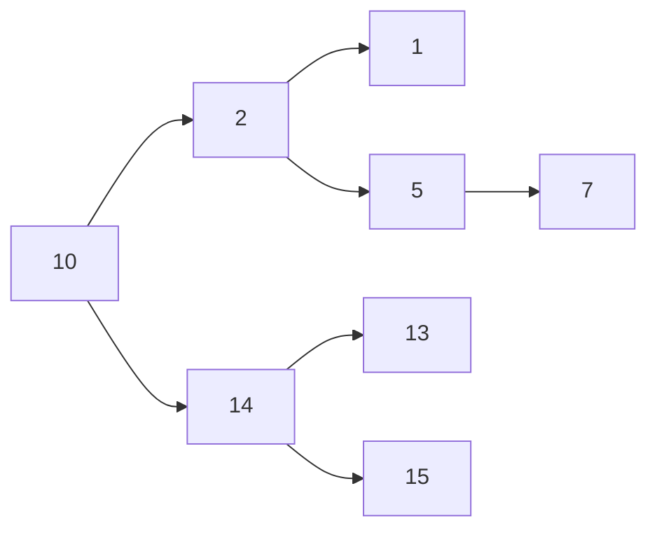
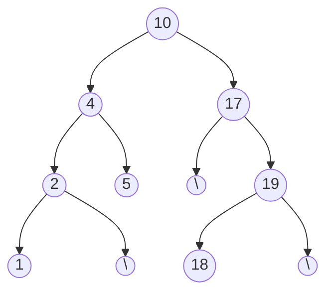
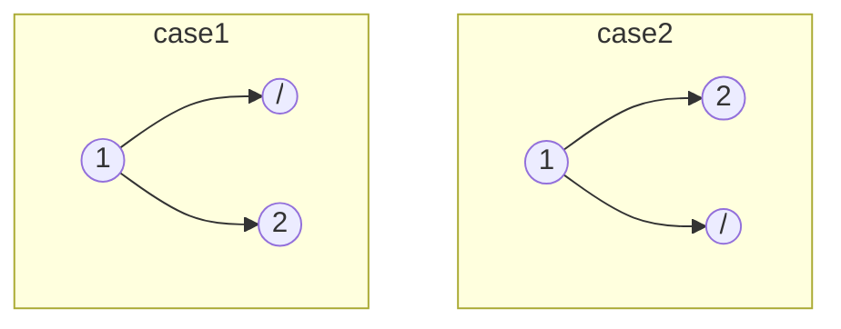

## TOC:

| Problem Name                                   | Problem Name                                 | Problem Name                               | Problem Name                                       |
| ---------------------------------------------- | -------------------------------------------- | ------------------------------------------ | -------------------------------------------------- |
| &check; 1. Two Number Sum                      | &check; 41. Invert Binary Tree               | &check; 81. Four Number Sum                | &cross; 121. Shorten Path                          |
| &check; 2. Validate Subsequence                | &check; 42. Binary Tree Diameter             | &check; 82. Subarray Sort                  | &cross; 122. Largest Rectangle Under Skyline       |
| &check; 3. Sorted Squared Array                | &check; 43. Find Successor                   | &check; 83. Largest Range                  | &cross; 123. Longest Substring Without Duplication |
| &check; 4. Tournament Winner                   | &check; 44. Height Balanced Binary Tree      | &check; 84. Min Rewards                    | &cross; 124. Underscorify Substring                |
| &check; 5. Non-Constructible Change            | &check; 45. Max Subset Sum No Adjacent       | &check; 85. Zigzag Traverse                | &cross; 125. Pattern Matcher                       |
| &check; 6. Find Closest Value In BST           | &check; 46. Number Of Ways To Make Change    | &check; 86. Same BSTs                      | &cross; 126. Multi String Search                   |
| &check; 7. Branch Sums                         | &check; 47. Min Number Of Coins For Change   | &check; 87. Validate Three Nodes           | &cross; 127. Apartment Hunting                     |
| &check; 8. Node Depths                         | &check; 48. Levenshtein Distance             | &check; 88. Max Path Sum                   | &cross; 128. Calendar Matching                     |
| &check; 9. Depth-first Search                  | &check; 49. Number Of Ways To Traverse Graph | &check; 89. Find Nodes Distance K          | &cross; 129. Waterfall Streams                     |
| &check; 10. Minimum Waiting Time               | &check; 50. Kadane's Algorithm               | &check; 90. Max Sum Increasing Subsequence | &cross; 130. Minimum Area Rectangle                |
| &check; 11. Class Photos                       | &check; 51. Single Cycle Check               | &check; 91. Longest Common Subsequence     | &cross; 131. Line Through Points                   |
| &check; 12. Tandem Bicycle                     | &check; 52. Breadth-first Search             | &check; 92. Min Number Of Jumps            | &cross; 132. Right Smaller Than                    |
| &check; 13. Remove Duplicates From Linked List | &check; 53. River Sizes                      | &check; 93. Water Area                     | &cross; 133. Iterative In-order Traversal          |
| &check; 14. Nth Fibonacci                      | &check; 54. Youngest Common Ancestor         | &check; 94. Knapsack Problem               | &cross; 134. Flatten Binary Tree                   |
| &check; 15. Product Sum                        | &check; 55. Remove Islands                   | &check; 95. Disk Stacking                  | &cross; 135. Right Sibling Tree                    |
| &check; 16. Binary Search                      | &check; 56. Cycle In Graph                   | &check; 96. Numbers In Pi                  | &cross; 136. All Kinds Of Node Depths              |
| &check; 17. Find Three Largest Numbers         | &check; 57. Minimum Passes Of Matrix         | &check; 97. Maximum Sum Submatrix          | &cross; 137. Compare Leaf Traversal.mp4            |
| &check; 18. Bubble Sort                        | &check; 58. Task Assignment                  | &check; 98. Maximize Expression            | &cross; 138. Max Profit With K Transactions        |
| &check; 19. Insertion Sort                     | &check; 59. Valid Starting City              | &cross; 99. Dijkstra's Algorithm           | &cross; 139. Palindrome Partitioning Min Cuts      |
| &check; 20. Selection Sort                     | &check; 60. Min Heap Construction            | &cross; 100. Topological Sort              | &cross; 140. Longest Increasing Subsequence        |
| &check; 21. Palindrome Check                   | &cross; 61. Linked List Construction         | &cross; 101. Boggle Board                  | &cross; 141. Longest String Chain                  |
| &check; 22. Caesar Cipher Encryptor            | &check; 62. Remove Nth Node From End         | &cross; 102. Continuous Median             | &cross; 142. Square Of Zeroes                      |
| &check; 23. Run-Length Encoding                | &check; 63. Sum Of Linked Lists              | &check; 103. Sort K-Sorted Array           | &cross; 143. Knuth–Morris–Pratt                    |
| &check; 24. Generate Document                  | &check; 64. Permutations                     | &cross; 104. Laptop Rentals                | &cross; 144. A-Star Algorithm                      |
| &check; 25. First Non-Repeating Character      | &check; 65. Powerset                         | &cross; 105. Find Loop                     | &cross; 145. Rectangle Mania                       |
| &check; 26. Three Number Sum                   | &check; 66. Phone Number Mnemonics           | &check; 106. Reverse Linked List           | &cross; 146. Detect Arbitrage                      |
| &check;27. Smallest Difference                 | &check; 67. Staircase Traversal              | &check; 107. Merge Linked Lists            | &cross; 147. Two-Edge-Connected Graph              |
| &check;28. Move Element To End                 | &check; 68. Search In Sorted Matrix          | &check; 108. Shift Linked List             | &cross; 148. Airport Connections                   |
| &check;29. Monotonic Array                     | &check; 69. Three Number Sort                | &cross; 109. Lowest Common Manager         | &cross; 149. Merge Sorted Arrays                   |
| &check;30. Spiral Traverse                     | &check; 70. Min Max Stack Construction       | &cross; 110. Interweaving Strings          | &cross; 150. LRU Cache                             |
| &check;31. Longest Peak                        | &check; 71. Balanced Brackets                | &cross; 111. Solve Sudoku                  | &cross; 151. Rearrange Linked List                 |
| &check;32. Array Of Products                   | &check; 72. Sunset Views                     | &cross; 112. Generate Div Tags             | &cross; 152. Linked List Palindrome                |
| &check;33. First Duplicate Value               | &cross; 73. Sort Stack                       | &cross; 113. Ambiguous Measurements        | &cross; 153. Zip Linked List                       |
| &check;34. Merge Overlapping Intervals         | &check; 74. Next Greater Element             | &cross; 114. Shifted Binary Search         | &cross; 154. Node Swap                             |
| &check;35. BST Construction                    | &check; 75. Longest Palindromic Substring    | &cross; 115. Search For Range              | &cross; 155. Number Of Binary Tree Topologies      |
| &check;36. Validate BST                        | &check; 76. Group Anagrams                   | &cross; 116. Quickselect                   | &cross; 156. Non-Attacking Queens                  |
| &check;37. BST Traversal                       | &check; 77. Valid IP Addresses               | &cross; 117. Index Equals Value            | &cross; 157. Merge Sort                            |
| &check;38. Min Height BST                      | &check; 78. Reverse Words In String          | &cross; 118. Quick Sort                    | &cross; 158. Count Inversions                      |
| &check;39. Find Kth Largest Value In BST       | &cross; 79. Minimum Characters For Words.mp4 | &cross; 119. Heap Sort                     | &cross; 159. Smallest Substring Containing         |
| &check;40. Reconstruct BST                     | &cross; 80. Suffix Trie Construction         | &cross; 120. Radix Sort                    | &cross; 160. Longest Balanced Substring            |

</br>

### 1. Two Number Sum:

**Problem**: Given total sum, find a pair of numbers in an array summing to that total sum. </br>
**Example**: For [-4,-1,1,3,5,6,8,11] {10} , ans is [11,-1]. </br>
**Solutions**: </br>

1. Approach 1: Double for loop. T: O(N^2); S O(1).
2. Approach 2: HashSet. T: O(N); S O(N).
3. Approach 3: Sort and Two pointer. T: O(NlogN); S:O(1).
   </br>

---

</br>

### 2. Validate Subsequence:

**Problem**: Check if given subsequence is valid for an array. Subsequence contains array elements in order, but some elements might be skipped.</br>

**Example**: For arr [5,1,22,25,6,-1,8,10] and subseq [1,6,-1,10], ans is true.</br>

**Solutions**:</br>

1. Approach 1: Linear scan of array and check if subseq element is present in order. T: O(N); S:O(1).
   </br>

---

### 3. Sorted Squared Array:

**Problem**: Given sorted a array of int, return its sorted squared int array. Do not modify the input array.</br>
**Example**: For arr [-2,-1,1,2,3,5,6,8,9] ans is [1,1,4,4,9,25,36,64,81]].</br>
**Solutions**:</br>

1. Approach 1: Generate new array with squared values, and then sort that array. T: O(NlogN) ; S: O(N).
2. 2 Pointer, and comparing absolute values. T: O(N) ; S:O(N).
   </br>

---

### 4. Tournament Winner:

**Problem**: Competition and results array given, tell which team is winner. Guaranteed that there is a winner (no tie).</br>
**Example**: For competition Array [[[[ "HTML" ,  "C#"],["C#","python"],["python","HTML"]]]] and results array is [0,0,1]. Answer for winner is "python".</br>
**Solutions**:</br>

1. Approach 1: Hashmap of Team and score. Also keep track of maximum score team on every update of team score. T: O(N) ; S:O(K). (N competitions and K teams).
   </br>

---

### 5. Non-Constructible Change:

**Problem**: Minimum change that cannot be created, considering all the coins available as given in an array. Cannot reuse a coin.</br>
**Example**: For coins array [5,7,1,1,2,3,22], ans is 4.</br>
**Solutions**:</br>

1. Approach 1: Try out in sequence, whether it is possible to construct a sum. Very complicated.
2. Approach 2: Sort the coin array first. If any new coin is greater than C+1 (C is coins cum sum), then we can't create C+1 coin. T: O(NlogN) ; S: O(1).

```java
Arrays.sort(coins);
int currentChangeCreated=0;
for(coin in coins){
	if(coin > currentChangeCreated + 1)
		return currentChangeCreated + 1;
	currentChangeCreater += coin;
}
return currentChangeCreated + 1;
```

</br>

---

### 6. Find Closest Value in BST:

**Problem**: Given a BST, and a target value, find the closest value to target, present in BST. </br>
**Solutions**:</br>

1. Approach 1: Visit all BST nodes and track number with smallest absolute difference. T: O(N) ; S: O(1).
2. Approach 2: If BST node smaller than target, then can eliminate firther search to left of BST node. T: O(N) {for skewed BST, but logN on avg} ; S: (N) {for recursion call stack sweked, but on avg O(logN)}.
3. Approach 3: Iteratively traverse BST. T:O(N); S:O(1).

```java
// Recursive:
private int helper(TreeNode node, int target, int closestNodeVal){
	// Reached end of BST:
	if(node == null) return closestNodeVal;
	// Update the closest value, if current node is appropriate for that.
	if(Math.abs(target - closestNodeVal) > Math.abs(target - node.value)
		closestNodeVal = node.val;
	// if current node too big, then go left:
	if(target < node.value)
		return helper(node.left, target, closestNodeVal);
	// if current node too small, then go right:
	else if(target > node.val)
		return helper(node.right, target, closestNodeVal);
	// current node === target
	else
		return closestNodeVal;
}
// Iterative:
private int helper(TreeNode node, int target){
	closestNodeVal = Integer.MAX_VALUE;
	currentNode = node;
	while(currentNode != null){
		// Update the closest value, if current node is appropriate for that.
		if(Math.abs(target - closestNodeVal) > Math.abs(target - node.value)
			closestNodeVal = currentNode.val;
		// if current node too big, then go left:
		if(target < node.value)
			currentNode = currentNode.left;
		// if current node too small, then go right:
		else if(target > node.val)
			currentNode = currentNode.right;
		// current node === target
		else
			break;
	}
	return closestNodeVal;
}
```

</br>

---

### 7. Branch Sums of Tree:

**Problem**: Given a Tree, return the sum of all branches (from root to leaf) as a list. </br>
**Solutions**: </br>

1. Approach 1: Traverse all nodes of tree in inorder traversal, and keep trac of running sum. On reaching the leaf node, append branch sum to list of branch sums. T: O(N) ; S: O((N + Num\_ of_Leaf nodes) <= 2N => so, N) (skewed tree). </br>
   </br>

---

### 8. Node Depths:

**Problem**: Given a Binary Tree, return the sum of node depths of all nodes of the tree. Here, node depth of tree is the distance between root and node of that tree.</br>
**Solutions**:</br>

1. Approach 1: Recursion. T: O(N) ; S: O(h).
2. Approach 2: Iteration, using a Stack. T:O(N) ; S:O(h).

```java
private int nodeDepth(TreeNode node, int depth=0){
	if(root == null) return 0;
	return depth + nodeDepth(node.left,depth+1) + nodeDepth(node.right,depth+1) ;
}
```

</br>

---

### 9. Depth first search on n-ary Tree:

**Problem**: Given a n-ary Tree, return an array containing DFS traversal. </br>
**Solutions** : </br>

1. Approach 1: Recursion with inorder traversal. T: O(N) ; S: O(h). </br>

```java
private ArrayList<Integer> list = new ArrayList<>();

private void dfs(TreeNode node){
	if(node == null) return;

	list.append(node.val);

	for(TreeNode child : node.children){
		dfs(child);
	}
}
```

</br>

---

### 10. Minimum Waiting Time:

**Problem**: Given an array mentioning time required to execute tasks, output the minimum waiting times to execute all tasks.</br>
**Example**: For jobs with execution times [3,2,1,2,6], the minimum eaiting time is 17. As they can be scheduled as [1,2,2,3,6] giving waiting times as [(0)+(0+1)+(0+1+2)+(0+1+2+2)+(0+1+2+2+3)] = [0+1+3+5+8] = 17.</br>
**Solutions**: </br>

1. Approach 1: Greedy. Sort in Ascending order, and add all execution times till penultimate array element. T: O(NlogN) ; S: O(1).</br>

```java
    private static int minWaitTime(int[] queries){
        Arrays.sort(queries);
        int totalWaitingTime=0;
        for(int i=0 ; i<queries.length-1 ; i++){
            int waitDuration = queries[i];
            int timesRepeated = (queries.length-1 - i);
            totalWaitingTime += waitDuration*timesRepeated;
        }
        return totalWaitingTime;
    }
```

</br>

---

### 11. Class Photos:

**Problem**: Given two arrays of student heights wearing and red and blue shirts. Number of students wearing red and blue shirts are same. They need to be arranged in two rows for a class photo. All red shirts need to be in the same row and all blue shirts need to be in same row. The student standing in front should be shorter than the one standing behind. You can reorder the red and blue shirt students in their rows. Return true if is possible to arrange students for such a class Photo. </br>
**Example**: redShirts=[5,8,1,3,4] ; blueShirts=[9,4,2,4,5]. Answer is True. </br>
**Solutions**: </br>

1. Approach 1: Shirt group with tallest student needs to be in the row behind. Sort red and blue shirt heights. Then keep checking if traversing in descending order in red and blue shirts, the front row guy is always lesser than rear row guys. T: O(NlogN) ; S: O(1).
   </br>

---

### 12. Tandem Bicycle:

**Problem**: Given two arrays of speeds of red shirt and blue shirt riders (of same length). We need to pair them to either get fastest or slowest total speeds. Speed of a pair is the max of the two rider. Find the maximum or minimum total speeds of the tandem bicycle riders.</br>
**Example**: redShirts=[5,5,3,9,2] ; blueShirts=[3,6,7,2,1]. Fastest speed is 32, slowest speed is 25.</br>
**Solutions**:</br>

1. Approach 1: Sort the two arrays. If fastest pairing asked, then group largest of one with the most minimum of other. If slowest is asked, then pair slowest of one with slowest of other. T: O(NlogN) ; S: O(1).
   </br>

---

### 13. Remove Duplicates From Linked List:

**Problem**: Given a sorted Linked Lists, remove the duplicates from the Linked List.</br>
**Example**: LL given = {1->1->3->4->4->4->5->6->6}. Ans is {1->3->4->5->6}.</br>
**Solutions**:</br>

1. Approach 1: Sorted array means that duplicate values will be grouped. T: O(Nl) ; S: O(1).</br>

---

### 14. N-th Fibonacci:

**Problem**: Find the N-th Fibanacci number.</br>
**Solutions**:</br>

1. Approach 1: Recursive, memoised. T: O(N) ; S: O(N).</br>
2. Approach 2: Iterative DP: T: O(N) ; S: O(1).</br>
   </br>

---

### 15. Product Sum:

**Problem**: Array containing numbes and other special arrays. Find Product Sum of the array. For product sum, you sum up the numbers in that array, but if there is a special array inside it then you multiply the depth of that special array in sum of the elements of the special array.</br>
**Example**: For special array [5,2,[7,-1],3,[6,[-13,8],4]], the productSum is 12.</br>
**Solutions**:</br>

1. Approach 1: Recursive.</br>

```java
// O(n) time | O(d) space - where n is total number of elements
// including sub-elements, and d is the greatest depth of "special"
public int productSum(List<Object> array) {
	return productSumHelper(array, 1);
}
private int productSumHelper(List<Object> array, int multiplier){
	int sum = 0;
	for (Object el : array) {
		if (el instanceof ArrayList) {
			@SuppressWarnings("unchecked")
			ArrayList<Object> ls = (ArrayList<Object>) el;
			sum += productSumHelper(ls, multiplier + 1);
		} else {
			sum += (int) el;
		}
	}
	return sum * multiplier;
}
```

</br>

---

### 16. Binary Search:

**Problem**: Binary search for an element in array. </br>
**Solutions**:</br>

1. Approach 1: Recursive.</br>
2. Approach 1: Iterative.</br>
   </br>

---

### 17. Three Largest Numbers:

**Problem**: Given an array, return the sorted array of three largest numbers. </br>
**Solutions**:</br>

1. Approach 1: Sort whole array and return 3 larges.
2. Approach 2: Traverse the whole array and keep track of three largest numbers.
3. Approach 3: Maintain a sorted array (initialized to -Inf values), and shift and update the three largest numbers collected in this array, while linearly traversing the main array.
4. Approach 4: Priority Queue: MinHeap of size 3.
   </br>

---

### 18. Bubble Sort:

**Problem**: Given an array, Bubble sort the array.
**Solutions**:

1. Approach 1: Swap a pair of elements (i,i+1) if elements not sorted in these positions. This is bubbling up. If a swap is performed, then perform above check again. T : O(N^2) ; S : O(1).
   </br>

---

### 19. Insertion Sort:

**Problem**: Given an array, Insertion sort the array.</br>
**Solutions**:

1. Approach 1: At an iteration, array is relatively sorted before the current element and relatively unsorted after the current element position. Just try to place the current element in right place in sorted section, by swapping with consecutively previous element. Perform the rest of the iterations to cover rest of the array. T : O(N^2) ; S : O(1).
   </br>

---

### 20. Selection Sort:

**Problem**: Given an array, Selection sort the array. </br>
**Solutions**:

1. Approach 1: Array gets divided in two parts. Absolutely sorted part and unsorted part. Choose any position, and to get the element which belongs to this position, traverse on unsorted array side and find minimum number to place at the current position. Current position is now also part of the sorted part. Continue for the next element in array. T : O(N^2) ; S : O(1).
   </br>

---

### 21. Palindrome Check:

**Problem**: Check if given string is a palindrome or not.
</br>

---

### 22. Caesar Cipher Encryptor:

**Problem**: Given a string and shiftKey, find the Caesar Ciphered String.</br>
**Example:** string ="xyz", and key=2 ==> encrypted string is "zab".</br>
**Solution:**</br>

```java
public static String caesarCypherEncryptor(String str, int key) {
	char[] newLetters = new char[str.length()];
	int newKey = key % 26;
	for (int i = 0; i < str.length(); i++) {
		newLetters[i] = getNewLetter(str.charAt(i), newKey);
	}
	return new String(newLetters);
}
public static char getNewLetter(char letter, int key) {
	int newLetterCode = letter + key;
	return newLetterCode <= 122 ?
		(char) newLetterCode :
		(char) ( 96 + (newLetterCode) % 122 );
}
```

</br>

---

### 23. Run-Length Encoding:

**Problem**: Compress the string into Run-Length Encoding. Max digits you could encode a repeating char is 9, as if double digit, then can create confusion in encoding (like which part is actually repeated).</br>
**Example:** AAAAAAAAAAAAABBCCCCDD => 9A4A2B4C2D. Not 13A2B4C2D, as not clear whether 13A means 111A or 1AAA. Using delimiter also not allowed, as that might be a part of the string.</br>
**Solution:**</br>

```java
write code
```

</br>

---

### 24. Generate Document:

**Problem**: Given a source String and a destination string, tell if using all the characters of source String, we can make the destination string.</br>
**Solution:** Make FreqMap of source string, and linearly traverse the destination string to reduce the count of characters available from source string. If all the destinatio string characters can be obtained from source string, then OK, but if any character is not available then false.</br>

```java
copy
```

</br>

---

### 25. First Non-Repeating Character:

**Problem**: Given a string, return the first non-repeating character.</br>
**Solution:**

1. Approach 1: Brute force: Double for loop. Starting from the left, for every character, check if that character is present till the end. If present, then this can't be the first non-repeating char. So check the next char. If any such char only appears once, then it is the first non-repeating character. T: O(N^2) ; S: O(1).
2. Approach 2: Char freq map (of only 26 chars possible). Two passes, where first pass is for calculating freq of each char. Second pass is where we check the first character with freq as 1. T: O(N) ; S: O(1).
   </br>

---

### 26. Three Number Sum:

**Problem**: Given an array with non-repeated ints, and a target sum. Find all triplets with the target sum. Do not give duplicate triplets.</br>
**Example:** for arr: [12,3,1,2,-6,5,-8,6] and targetSum =0, we have triplets as [{-8,2,6},{-8,3,5},{-6,1,5}]. </br>
**Solution:**</br>

1. Approach 1: Brute force: 3 for Loops. T: O(N^3) ; S: O(1).
2. Approach 2: Sort the array and use 2 pointers. T: O(N^2) ; S: O(1) {for storing triplets}.
   </br>

---

### 27. Smallest Difference:

**Problem**: Find two closest numbers from two given arrays. So one element comes form one array, and other comes from other elements.</br>
**Example:** for arr1: [-1,5,10,20,28,3] and arr2:[26,134,135,15,17] and the required pair is [28,26].</br>
**Solution:**</br>

1. Approach 1: Brute force: 2 for Loops. 1 on one array and other on other array. T: O(N^2) ; S: O(1).
2. Approach 2: Sort the arrays and use 1 pointer on each array. Keep capturing differences and try to move the smaller element pointer ahead. T: O(NlogN+MlogM) ; S: O(1).
   </br>

---

### 28. Move Element to End:</br>

**Problem**: Given an array and a target number, move all elements equal to target number to the end of the array.</br>
**Example:** for arr: [2,1,2,2,2,3,4,2] and element 2, we have output array as [1,3,4,2,2,2,2,2].</br>
**Solution:**

1. Approach 1: Brute force: Sort the array and start to move the target elemetns to the end. T: O(NlogN) ; S: O(1).
2. Approach 2: 2 Pointers. 1 at beginning and 1 at end. T: O(N) ; S: O(1).
   </br>

```java

// 0(n) time 1 0(1) space - where n is the length of the array
public static List<Integer> moveElementToEnd(List<Integer> array, int toMove) {
	int i = 0;
	int j = array.size() - 1;
	while (i < j) {
		while (i < j && array.get(j) == toMove) // i<j is important here.
			j--;
		if (array.get(i) == toMove)
			swap(i, j, array);
		i++;
	}
	return array;
}

public static void swap(int i, int j, List<Integer> array) {
	int temp = array.get(j);
	array.set(j, array.get(i));
	array.set(i, temp);
}
```

</br>

---

### 29. Monotonic Array:</br>

**Problem**: Given an array tell if it is a monotonic array. Monotonic means either entirely non-decreasing or entirely non-increasing (since duplicate elements possible).</br>
**Solution:**

1. Approach 1: Brute force: Determine the first direction taken by elements, and then ensure that all elements have that. Cumbersome to code.. T: O(N) ; S: O(1).
2. Approach 2: 2 Traversals, once checking if non-increasing and other time checking non-decreasing. If either then true. Can also do within the same loop. T: O(N) ; S: O(1).
   </br>

```java
// 0(n) time 1 0(1) space - where n is the length of the array
public static boolean isMonotonic(int[] array) {
	var isNonDecreasing = true;
	var isNonIncreasing = true;
	for (int i = 1; i < array.length; i++) {
		if (array[i] < array[i - 1]){
			isNonDecreasing = false;
		}
		if (array[i] > array[i - 1]) {
			isNonIncreasing = false;
		}
	}
	return isNonDecreasing || isNonIncreasing;
}

// DIRECTION Approach:
// 0(n) time 1 0(1) space - where n is the length of the array
public boolean isMonotonic(int[] array) {
	if (array.length <= 2)
		return true;
	var direction = array[1] - array[0];
	for (int i = 2; i < array.length; i++) {
		if (direction == 0) {
			direction = array[i] - array[i - 1];
			continue;
		}
		if (breaksDirection(direction, array[i - 1], array[i])) {
			return false;
		}
	}
	return true;
}
public boolean breaksDirection(int direction, int previous, int current){
	var difference = current - previous;
	if (direction > 0) return difference < 0;
	return difference > 0;
}

```

</br>

---

### 30. Spiral Traverse:</br>

**Problem**: Given a rectangular 2d array, return a 1D array which is spiral traversal of the 2d matrix.</br>
**Solution:** </br>

1. Approach 1: T: O(N \* M) ; S: O(1).
2. Approach 2: Recursive Approach, where we deal with every perimeter in one recursion call stack. T: O(N) ; S: O(P), where P is number of perimeters (Min(N,M)).
   </br>

```java
// Iterative:

public static List<Integer> spiralTraverse(int[][] array) {
    if (array.length == 0) return new ArrayList<Integer>();
    var result = new ArrayList<Integer>();
    var startRow = 0;
    var endRow = array.length - 1;
    var startCol = 0;
    var endCol = array[0].length - 1;
    while (startRow <= endRow && startCol <= endCol) {
        for (int col = startCol; col <= endCol; col++) {
            result.add(array[startRow][col]);
        }
        for (int row = startRow + 1; row <= endRow; row++) {
            result.add(array[row][endCol]);
        }
        for (int col = endCol - 1; col >= startCol; col--) {
            if (startRow == endRow) break;
            result.add(array[endRow][col]);
        }
        for (int row = endRow - 1; row > startRow; row--) {
            if (startCol == endCol) break;
            result.add(array[row][startCol]);
        }
        startRow++;
        endRow--;
        startCol++;
        endCol--;
    }
    return result;
}

// Recursive:

public static List<Integer> spiralTraverseRecursive(int[][] array) {
	if (array.length == 0) return new ArrayList<Integer>();
	var result = new ArrayList<Integer>();
	spiralFill(array, 0, array.length - 1, 0, array[0].length - 1, result);
	return result;
}

public static void spiralFill(
	int[][] array, int startRow, int endRow, int startCol, int endCol,ArrayList<Integer> result) {
		if (startRow > endRow || startCol > endCol) {
		return;
	}
	for (int col = startCol; col <= endCol; col++) {
		result.add(array[startRow][col]);
	}
	for (int row = startRow + 1; row <= endRow; row++) {
		result.add(array[row][endCol]);
	}
	for (int col = endCol - 1; col >= startCol; col--) {
		if (startRow == endRow) break;
		result.add(array[endRow][col]);
	}
	for (int row = endRow - 1; row >= startRow + 1; row--) {
		if (startCol == endCol) break;
		result.add(array[row][startCol]);
	}
	spiralFill(array, startRow + 1, endRow - 1, startCol + 1, endCol - 1, result);
}

```

</br>

---

### 31. Length of Longest Peak:</br>

**Problem**: Given an integer array, find the length of longest peak.</br>
**Example**: [1,2,3,3,4,0,10,6,5,-1,-3,2,3] => 6
**Solution:** </br>

1. Approach 1: Find the peaks in the array, and then find the longest run for each peak (on either side of the peak). T: O(N) ; S: O(1).
2. Approach 2: Find the peak and the longest run in the same iteration. T: O(N) ; S: O(1).
   </br>

```java
public static int longestPeak(int[] array) {
	int longestPeakLength = 0;
	int i = 1;
	while (i < array.length - 1) {
		boolean isPeak = array[i - 1] < array[i] && array[i] > array[i + 1];
		if (!isPeak) {
			i += 1;
			continue;
		}
		int leftIdx = i - 2;
		while (leftIdx >= 0 && array[leftIdx] < array[leftIdx + 1]) {
			leftIdx -= 1;
		}
		int rightIdx = i + 2;
		while (rightIdx < array.length && array[rightIdx] < array[rightIdx - 1]) {
			rightIdx += 1;
		}
		int currentPeakLength = rightIdx - leftIdx - 1;
		if (currentPeakLength > longestPeakLength) {
			longestPeakLength = currentPeakLength;
		}
		i = rightIdx;
	}
	return longestPeakLength;
}

```

</br>

---

### 32. Array of Products:</br>

**Problem**: Given an integer array, find the length of longest peak.</br>
**Example**: For [5,1,4,2], the array we have is [8,40,10,20].
**Solution:** </br>

1. Approach 1: Nested 'For' loops at two levels. When i==j, then continue. T: O(N^2) ; S: O(N) (Since need to store products calculate in new array).
2. Approach 2: Prefix and Suffix Product arrays. For each element, multiply prefix and suffix product array values. T: O(N) ; S: O(N).
3. Approach 3: Construct only one amongst the Prefix or Suffix Product arrays. And take a running product element. For each element, running product element with suffix (or prefix product element). T: O(N) ; S: O(N).
   </br>

---

### 33. First Duplicate Value:</br>

**Problem**: Given an integer array, containing numbers from 1 to n with duplicate values. Find the first duplicate value (occuring first as a duplicate in the array, if multiple duplicate values exist). If no duplicate value exists, then return -1. You can mutate the array.</br>
**Example**: For [2,1,5,3,2,3,4] ans is 2 (not 3, since 2 occurs earlier in array).
**Solution:** </br>

1. Approach 1: Nested 'For' loops at two levels. The first duplicate value found is returned. T: O(N^2) ; S: O(1).
2. Approach 2: Use a set, and return the first found duplicate value. T: O(N) ; S: O(N).
3. Approach 3: Make the value and index of (|value|-1) to negative. And every time check if a value is negative. If negative, then this is duplicate value. T: O(N) ; S: O(1).
   </br>

---

### 34. Merge Overlapping Intervals:</br>

**Problem**: Given an array of intervals (with start and end times), return an array of merged intervals. Two intervals are overlapping, if they share any number in their ranges.</br>
**Example**: For [[1,2],[3,5],[4,7],[6,8],[9,20]]] , we get [[1,2],[3,8],[9,10]].
**Solution:** </br>

1. Approach 1:If intervals are sorted in ascending orders of their start times, then two meetings overlap if end0 >= start1 (where 0 and 1 are for two intervals whose start0 <= start1). T: O(NlogN) ; S: O(N) (for the output array of merged intervals).
   </br>

---

### 35. BST Construction:</br>

**Problem**: Insertion, Searching and (importantly) Deletion.</br>
**Solution:** </br>

```java
class Program {

	static class BST {
			public int value;
			public BST left;
			public BST right;
			public BST(int value) {
			this.value = value;
		}

		// Average: O(log(n)) time | O(1) space
		// Worst: O(n) time | O(1) space
		public BST insert(int value) {
			BST currentNode = this;
			while (true) {
				if (value < currentNode.value) {
					if (currentNode.left == null) {
						BST newNode = new BST(value);
						currentNode.left = newNode;
						break;
					} else {
						currentNode = currentNode.left;
					}
				} else {
					if (currentNode.right == null) {
						BST newNode = new BST(value);
						currentNode.right = newNode;
						break;
					} else {
						currentNode = currentNode.right;
					}
				}
			}
			return this;
		}

		// Average: O(log(n)) time | O(1) space
		// Worst: O(n) time | O(1) space
		public boolean contains(int value) {
			BST currentNode = this;
			while (currentNode != null) {
				if (value < currentNode.value) {
					currentNode = currentNode.left;
				} else if (value > currentNode.value) {
					currentNode = currentNode.right;
				} else {
					return true;
				}
			}
			return false;
		}

		// Average: O(log(n)) time | O(1) space
		// Worst: O(n) time | O(1) space
		public BST remove(int value) {
			remove(value, null);
			return this;
		}

		public void remove(int value, BST parentNode) {
			BST currentNode = this;
			while (currentNode != null) {
				if (value < currentNode.value) {
					parentNode = currentNode;
					currentNode = currentNode.left;
				} else if (value > currentNode.value) {
					parentNode = currentNode;
					currentNode = currentNode.right;
				} else {
					if (currentNode.left != null && currentNode.right != null) {
						currentNode.value = currentNode.right.getMinValue();
						currentNode.right.remove(currentNode.value, currentNode);
					} else if (parentNode == null) {
						if (currentNode.left != null) {
							currentNode.value = currentNode.left.value;
							currentNode.right = currentNode.left.right;
							currentNode.left = currentNode.left.left;
						} else if (currentNode.right != null) {
							currentNode.value = currentNode.right.value;
							currentNode.left = currentNode.right.left;
							currentNode.right = currentNode.right.right;
						} else {
							// This is a single-node tree; do nothing.
						}
					} else if (parentNode.left == currentNode) {
						parentNode.left = currentNode.left != null ? currentNode.left : currentNode.right;
					} else if (parentNode.right == currentNode) {
						parentNode.right = currentNode.left != null ? currentNode.left : currentNode.right;
					}
					break;
				}
			}
		}

		public int getMinValue() {
			if (left == null) {
				return value;
			}
			return left.getMinValue();
		}
	}
}
```

---

### 36. Validate BST:</br>

**Problem**: Validate a BST.</br>
**Solution:** </br>

```java
class Program {
	// O(n) time | O(d) space
	public static boolean validateBst(BST tree) {
		return validateBst(tree, Integer.MIN_VALUE, Integer.MAX_VALUE);
	}

	public static boolean validateBst(BST tree, int minValue, int maxValue) {
		if (tree.value < minValue || tree.value >= maxValue) {
			return false;
		}
		if (tree.left != null && !validateBst(tree.left, minValue, tree.value)) {
			return false;
		}
		if (tree.right != null && !validateBst(tree.right, tree.value, maxValue)) {
			return false;
		}
		return true;
	}

	static class BST {
		public int value;
		public BST left;
		public BST right;
		public BST(int value) {
			this.value = value;
		}
	}
}
```

---

### 37. BST Tree Traversals:</br>

**Problem**: Inorder, Pre-Order, Post-Order.</br>
**Solution:** </br>

---

### 38. Min Height BST:</br>

**Problem**: Given a _sorted_ array of _distinct_ integers, return a BST with minimum height. Insert method given to you.</br>
**Example:** for [1,2,5,7,10,13,14,15,22] we have following as a min Height BST.</br>



**Solution:** </br>

-   Approach 1: We want BST to be as balanced in left and right subtrees. So root node will be the middle element of the sorted input array. Recursively repeat the process.

```java
// O(n) time | O(n) space - where n is the length of the array
public static BST minHeightBst(List<Integer> array) {
	return constructMinHeightBst(array, 0, array.size() - 1);
}
public static BST constructMinHeightBst(List<Integer> array, int startIdx, int endIdx) {
	if (endIdx < startIdx) return null;
	int midIdx = (startIdx + endIdx) / 2;
	BST bst = new BST(array.get(midIdx));
	bst.left = constructMinHeightBst(array, startIdx, midIdx - 1);
	bst.right = constructMinHeightBst(array, midIdx + 1, endIdx);
	return bst;
}
```

</br>

---

### 39. Find Kth Largest Value in BST:</br>

**Problem**: Find K-th largest value in BST. </br>
**Solution:** </br>

-   Approach 1: In order traversal with a counter in BST. Also track the value of kth node. T:O(N) ; S:O(N).
-   Approach 2: Reverse In order traversal with a counter in BST. Also track the kth node value. T:O(N) ; S:O(N).

</br>

---

### 40. Reconstruct BST:</br>

**Problem**: Given pre-order traversal of a BST consisting of unique values, construct a BST with the same pre-order traversal. </br>
**Example**: For pre-order traversal array : [10,4,2,1,5,17,19,18], the BST is:



**Insight:** For a given preorder traversaal, there are many Binary trees possible, but only 1 BST possible. For [1,2] as pre-order traversal, have following possible BTs. </br>



**Solution:**

-   Approach 0: Unique Binary tree can be constructed using an inorder and preOrder traversal. BST's inorder traversal is a sorted array. So sort the preOrder array to get inOrder array, and construct the unique Binary tree for that. T: O(NlogN), S: O(N).
-   Approach 1: First node is root. Then onwards all the smaller elements constitute left subtree. And all the greater elements form right subtree. Do a postorder traversal where curent node's left and right subtrees are created first, and then linked to current node. T:O(N^2) ; S:O(N).
-   Approach 2: Tracking 3 things, and creating a node if node value ()is in range. T:O(N) ; S:O(N) :
    -   rootIndex: the index of the node in preorder traversal we are trying to create.
    -   lower bound value for node's value. Start with -Inf.
    -   upper bound value for node's value. Start with +Inf.

```java

// Approach 1:
class Solution{
	public void solve(int[] preOrder)){
		if(preOrder.length == 0) return null;
		return helper(preOrder, 0, preOrder.length);
	}

	private TreeNode helper(int[] preOrder, int lowIdx, int highIdx){
		if(highIdx<lowIdx) return null;

		int currNodeValue = new TreeNode(preOrder[lowIdx]);
		int leftSubtreeRightBound = preOrder.length;
		for(int i=lowIdx ; i<highIdx ; i++){
			if(currNodeValue < preOrder[i] ){
				leftSubtreeRightBound = i;
				break;
			}
		}

		TreeNode node = new TreeNode(currNodeValue);
		node.left = helper(preOrder, lowIdx+1, leftSubTreeRightBound);
		node.right = helper(preOrder, leftSubTreeRightBound , highIdx);

		return node;
	}
}

// Approach 2:
class Solution {
    int idx=0;
    public TreeNode bstFromPreorder(int[] preorder) {
        return helper(Integer.MIN_VALUE,Integer.MAX_VALUE,preorder);
    }

    private TreeNode helper(int lo, int hi, int[] preorder){
        if(idx==preorder.length) return null;

        int value = preorder[idx];
        if(value<lo || value>hi) return null;

        idx++;
        TreeNode root = new TreeNode(value);
        root.left  = helper(lo,value,preorder);
        root.right = helper(value,hi,preorder);

        return root;
    }
}
```

</br>

---

### 41. Invert Binary Tree:</br>

**Problem**: Invert a given Binary tree.</br>
**Solution:**

-   Approach 1: Iterative-BFS: level by level, and swap every node's child nodes. Then move to the next level. T: O(N), S:O(N)
-   Approach 2: Recursively-DFS: Just invert the right and left child of each node. T:O(N) ; S:O(N).

</br>

---

### 42. Binary Tree Diameter:</br>

**Problem**: Find the diameter of a given binary tree. Diameter is the longest path between two leaf nodes. Diameter does not need to pass through the root node.</br>
**Solution:**

-   Approach 1: DFS: For any node, consider max of diameter in left subtree, diameter in right subtree and path including the current node. Path requires knowing heights of left and right subtrees. Every node returns to the parent the max diameter and height of that node. T: O(N), S:O(N)

```java
class Info{
	int diam;
	int height;
	public Info(int d,int h){
		this.diam = d;
		this.height = h;
	}
}

class Solution{
	public int solve(TreeNode root){
		return helper(root).diam;
	}

	private Info helper(TreeNode node){
		if(node == null) return new Info(0,0);

		Info leftInfo = helper(node.left);
		Info rightInfo = helper(node.right);

		int pathLengthIncludingNode = leftInfo.height + rightInfo.height + 1;
		int maxDiam = Math.max(
			leftInfo.diam,
			rightInfo.diam,
			pathLengthIncludingNode
		);

		int height = 1 + Math.max(leftInfo.height , rightInfo.height);

		return new Info(maxDiam, height);
	}
}

```

</br>

---

### 43. Find Successor:</br>

**Problem**: Find successor of a given node of Binary tree. Successor is the next node to be visited in an inorder traversal. </br>
**Solution:**

-   Approach 1: Do an inorder traversal of entire binary tree, and store the entire inorder traversal in array. Find the value next to Given node value. T: O(N), S:O(N) .
-   Approach 2: But we don't need to traverse entire binary tree and store the entire inorder traversal in an array. T: O(height), S:O(1).

    -   If a node has a right subtree, then the inorder successor of that node can only be in its right subtree. Bcoz, inorder traversal is `left`, `node`, `right`, where `right` comes after `node`. We can look for the `left` most element in right subtree of the given node.
        
    -   If there is no right subtree for the given node, then we need to find the parent node. If given node is left child of parent, then just the parent will be the answer. If the given node is right child of the parent, then parent's parent is the answer. </br>
        

    -   Lastly, if there is no further right subtree, or no parent whose left subtree contained the given node, then there is no successor. This was the last element in inorder traversal.

```java
// Approach 2:

class Program {
  	static class BinaryTree {
		public int value;
		public BinaryTree left = null;
		public BinaryTree right = null;
		public BinaryTree parent = null;

		public BinaryTree(int value) {
			this.value = value;
		}
  	}

  	public BinaryTree findSuccessor(BinaryTree tree, BinaryTree node) {

		// Case 1:
		if (node.right != null) return getLeftMostChild(node.right);

		// Case 2 and Case3:
		return getRightMostParent(node);
  	}

	private BinaryTree getLeftMostChild(BinaryTree root) {
		while (root.left != null) root = root.left;
		return root;
	}

	private BinaryTree getRightMostParent(BinaryTree node){
		// Checking for every traversal up the parent heirarchy:
		//	- Existence of a parent (since if no parent, then no successor)
		//	- That we came from right child of the parent node.
		while((currentNode.parent != null) && (currentNode.parent.right == currentNode)){
			currentNode = currentNode.parent;
		}
		return currentNode.parent;
	}
}

```

</br>

---

### 44. Height Balanced Binary Tree:</br>

**Problem**: In height Balanced Binary tree, for every node, the difference between the height of left subtree and right subtree is atmost 1. </br>
**Solution:**

-   Approach 1: Do an postorder traversal, where children return the height and wether they are height balanced or not. T: O(N), S:O(N) .

</br>

---

### 45. Max Subset Sum with no adjacent elements:</br>

**Problem**: Max Subset Sum with no adjacent elements. Array contains only +ve numbers only.</br>
**Example**: For [7,10,12,7,9,11] the sum is 7+12+14=33.
**Solution:**

-   Approach 1: maxSums[i]=max(maxSums[i-1], maxSums[i-2]+A[i]). T: O(N), S:O(N) .
-   Approach 2: current=max(first, second+A[i]). => second=first ; first=current. Loop for next element. T: O(N), S:O(1).
    </br>

---

### 46. Number of ways to make change:</br>

**Problem**: For a given total sum and given set of denominations of coins, how many ways can you make change for the total sum. You can choose infinite coins for any given denomination.</br>
**Example**: For $10 total sum, and denominations of [1,5,10,25], ways are 4. 1x10 ; 2x5 ; 1x5 + 5x1 ; 10x1.
**Solution:**

-   Approach 1: DP solution. T: O(N\*D), S:O(N).
    </br>

```java
public static int numberOfWaysToMakeChange(int n, int[] denominations) {
    int[] numOfWays = new int[n + 1];
    Arrays.fill(numOfWays, 0);
    numOfWays[0] = 1;

    for (int denomination : denominations) {
      for (int target = 1; target <= n; target++) {
        if (target >= denomination) numOfWays[target] += numOfWays[target - denomination];
      }
    }

	return numOfWays[n];
}
```

---

### 47. Min Number Of Coins For Change:</br>

**Problem**: Given a target sum, and infinite supply of coins of given denominations, find the minimum number of coins required to make the target sum. </br>
**Hint:** Greedy won't work. </br>
**Solution:**

-   Approach 1: DP solution. T: O(N\*D), S:O(N).
    </br>

```java
public static int minNumberOfCoinsForChange(int n, int[] DENOMINATIONS) {
	int[] minCoinsRequired = new int[n + 1];
    Arrays.fill(minCoinsRequired, Integer.MAX_VALUE);

    minCoinsRequired[0] = 0;
    int minCoins = 0;

    for (int denom : DENOMINATIONS) {
      for (int target = 0; target <= n; target++) {
        if (target < denom) continue;

        minCoins =
            minCoinsRequired[target - denom] == Integer.MAX_VALUE
                ? Integer.MAX_VALUE
                : 1 + minCoinsRequired[target - denom];

        minCoinsRequired[target] = Math.min(minCoinsRequired[target], minCoins);
      }
    }

    return minCoinsRequired[n] == Integer.MAX_VALUE ? -1 : minCoinsRequired[n];
}
```

---

### 50. Kadane's Algorithm:</br>

**Problem**: Find maximum Subarray Sum in a given array, with positive and negative int values.</br>
**Solution:**

-   Approach 1: 2 Nested for loops, to consider every subarray. T: O(N^2), S:O(1) .
-   Approach 2: Kadane's T: O(N), S:O(1).
    </br>

```java
class Program {
  public static int kadanesAlgorithm(int[] array) {
    // Write your code here.
    int currentSum = array[0], maximumSum = array[0];

    for (int idx = 1; idx < array.length; idx++) {
      currentSum = Math.max(array[idx], currentSum + array[idx]);
      maximumSum = Math.max(currentSum, maximumSum);
    }

    return maximumSum;
  }
```

---

### 51. Single Cycle Check:

```java
private static int jump(int currentIdx, int[] array) {
    int len = array.length;
    int jumpIdx = (currentIdx + array[currentIdx]) % len;

    return jumpIdx >= 0 ? jumpIdx : len + jumpIdx;
}

public static boolean hasSingleCycle(int[] array) {
    int currentIdx = 0, visitedElements = 0;

    while (visitedElements < array.length) {
      if (visitedElements > 0 && currentIdx == 0) return false;
      ++visitedElements;

      currentIdx = jump(currentIdx, array);
    }

    return currentIdx == 0;
}
```

---

### 52. Breadth-first Search:

```java
  static class Node {
    String name;
    List<Node> children = new ArrayList<Node>();

    public Node(String name) {
      this.name = name;
    }

    public List<String> breadthFirstSearch(List<String> array) {
      Queue<Node> queue = new LinkedList<>();
      queue.add(this);

      while (!queue.isEmpty()) {
        Node current = queue.poll();
        array.add(current.name);
        queue.addAll(current.children);
      }

      return array;
    }

    public Node addChild(String name) {
      Node child = new Node(name);
      children.add(child);
      return this;
    }
```

---

### 53. River Sizes:

```java
  public static List<Integer> riverSizes(int[][] matrix) {
    List<Integer> sizes = new ArrayList<>();
    int height = matrix.length, width = matrix[0].length;
    boolean[][] visited = new boolean[height][width];

    for (int row = 0; row < height; row++) {
      for (int col = 0; col < width; col++) {
        if (visited[row][col]) continue;

        traverseNodes(matrix, row, col, visited, sizes);
      }
    }

    return sizes;
  }

  private static void traverseNodes(
      int[][] matrix, int row, int col, boolean[][] visited, List<Integer> sizes) {
    int currentSize = 0;
    Queue<Integer[]> queue = new LinkedList<>();
    queue.add(new Integer[] {row, col});

    while (!queue.isEmpty()) {
      Integer[] currentNode = queue.poll();
      row = currentNode[0];
      col = currentNode[1];

      if (visited[row][col]) continue;
      visited[row][col] = true;

      if (matrix[row][col] == 0) continue;

      ++currentSize;
      List<Integer[]> neighbors = getNeighborsOfCurrentNode(matrix, row, col, visited);

      for (Integer[] neighbor : neighbors) queue.add(neighbor);
    }

    if (currentSize > 0) sizes.add(currentSize);
  }

  private static List<Integer[]> getNeighborsOfCurrentNode(
      int[][] matrix, int row, int col, boolean[][] visited) {
    List<Integer[]> neighbors = new ArrayList<>();
    int height = matrix.length, width = matrix[0].length;

    if (row > 0 && !visited[row - 1][col]) neighbors.add(new Integer[] {row - 1, col});

    if (row < height - 1 && !visited[row + 1][col]) neighbors.add(new Integer[] {row + 1, col});

    if (col > 0 && !visited[row][col - 1]) neighbors.add(new Integer[] {row, col - 1});

    if (col < width - 1 && !visited[row][col + 1]) neighbors.add(new Integer[] {row, col + 1});

    return neighbors;
  }
```

---

### 54. Youngest Common Ancestor:

```java
private static int depth(AncestralTree topAncestor, AncestralTree descendant) {
    int depth = 0;

    while (descendant != topAncestor) {
      descendant = descendant.ancestor;
      ++depth;
    }

    return depth;
  }

  private static AncestralTree backtrack(AncestralTree lower, AncestralTree higher, int diff) {
    while (diff-- > 0) lower = lower.ancestor;

    while (lower != higher) {
      lower = lower.ancestor;
      higher = higher.ancestor;
    }

    return lower;
  }

  // TC: O(d) | SC: O(1)
  public static AncestralTree getYoungestCommonAncestor(
      AncestralTree topAncestor, AncestralTree descendantOne, AncestralTree descendantTwo) {
    int depthOne = depth(topAncestor, descendantOne);
    int depthTwo = depth(topAncestor, descendantTwo);

    if (depthOne > depthTwo) return backtrack(descendantOne, descendantTwo, depthOne - depthTwo);

    return backtrack(descendantTwo, descendantOne, depthTwo - depthOne);
  }

  static class AncestralTree {
    public char name;
    public AncestralTree ancestor;

    AncestralTree(char name) {
      this.name = name;
      this.ancestor = null;
    }

    // This method is for testing only.
    void addAsAncestor(AncestralTree[] descendants) {
      for (AncestralTree descendant : descendants) {
        descendant.ancestor = this;
      }
    }
  }
```

---

### 55. Remove Islands:

```java
  /**
   * * TC: O(w * h)
   * * SC: O(w * h) | Better Average Space
   */
  public int[][] removeIslands(int[][] matrix) {
    int height = matrix.length, width = matrix[0].length;

    for (int row = 0; row < height; row++) {
      for (int col = 0; col < width; col++)
        if (row == 0 || row == height - 1 || col == 0 || col == width - 1) DFS(matrix, row, col);
    }

    for (int row = 0; row < height; row++) {
      for (int col = 0; col < width; col++) {
        if (matrix[row][col] == 1) matrix[row][col] = 0;

        if (matrix[row][col] == 2) matrix[row][col] = 1;
      }
    }

    return matrix;
  }

  private void DFS(int[][] matrix, int row, int col) {
    int height = matrix.length, width = matrix[0].length;
    if (row < 0 || row >= height || col < 0 || col >= width || matrix[row][col] == 2) return;

    if (matrix[row][col] == 0) return;

    matrix[row][col] = 2;

    DFS(matrix, row + 1, col);
    DFS(matrix, row - 1, col);
    DFS(matrix, row, col + 1);
    DFS(matrix, row, col - 1);
  }

  /**
   * * TC: O(w * h)
   * * SC: O(w * h)
   */
  // public int[][] removeIslands(int[][] matrix) {
  // 	int height = matrix.length, width = matrix[0].length;
  // 	boolean[][] visited = new boolean[height][width];

  // 	for (int row = 0; row < height; row++) {
  // 		for (int col = 0; col < width; col++)
  // 			if (row == 0 || row == height - 1 || col == 0 || col == width - 1)
  // 				DFS(matrix, row, col, visited);
  // 	}

  // 	for (int row = 1; row < height - 1; row++) {
  // 		for (int col = 1; col < width - 1; col++) {
  // 			if (matrix[row][col] == 0) continue;

  // 			if (matrix[row][col] == 1 && !visited[row][col])
  // 				matrix[row][col] = 0;
  // 		}
  // 	}

  // 	return matrix;
  // }

  // private void DFS(int[][] matrix, int row, int col, boolean[][] visited) {
  // 	int height = matrix.length, width = matrix[0].length;
  // 	if (
  // 		row < 0 || row >= height || col < 0 || col >= width ||
  // 		visited[row][col]
  // 	) return;

  // 	visited[row][col] = true;

  // 	if (matrix[row][col] == 0) return;

  // 	DFS(matrix, row + 1, col, visited);
  // 	DFS(matrix, row - 1, col, visited);
  // 	DFS(matrix, row, col + 1, visited);
  // 	DFS(matrix, row, col - 1, visited);
  // }
```

---

### 56. Cycle In Graph:

```java
  public final int WHITE = 0;
  public final int GRAY = 1;
  public final int BLACK = 2;

  public boolean cycleInGraph(int[][] edges) {
    int[] colors = new int[edges.length];
    Arrays.fill(colors, WHITE);

    for (int vertex = 0; vertex < edges.length; vertex++) {
      if (colors[vertex] != WHITE) continue;

      if (hasCycle(edges, vertex, colors)) return true;
    }

    return false;
  }

  private boolean hasCycle(int[][] edges, int vertex, int[] colors) {
    colors[vertex] = GRAY;

    for (int neighbor : edges[vertex]) {
      if (colors[neighbor] == GRAY) return true;

      if (colors[neighbor] == BLACK) continue;

      if (hasCycle(edges, neighbor, colors)) return true;
    }

    colors[vertex] = BLACK;

    return false;
  }

  /**
   * * TC: O(w * h)
   * * SC: O(w * h)
   */
  // public boolean cycleInGraph(int[][] edges) {
  //   // Write your code here.
  //   int len = edges.length;
  //   boolean[] visited = new boolean[len];
  //   boolean[] inStack = new boolean[len];

  //   for (int vertex = 0; vertex < len; vertex++) {
  //     if (visited[vertex]) continue;

  //     if (hasCycle(edges, vertex, visited, inStack)) return true;
  //   }

  //   return false;
  // }

  // private boolean hasCycle(
  //   int[][] edges, int vertex, boolean[] visited, boolean[] inStack
  // ) {
  //   if (inStack[vertex]) return true;

  //   if (visited[vertex]) return false;

  //   inStack[vertex] = true;
  //   visited[vertex] = true;

  //   for (int idx = 0; idx < edges[vertex].length; idx++)
  //     if (hasCycle(edges, edges[vertex][idx], visited, inStack))
  //       return true;

  //   inStack[vertex] = false;

  //   return false;
  // }
```

---

### 57. Minimum Passes Of Matrix:

```java
  // TC: O(wh) SC: O(wh)
  public int minimumPassesOfMatrix(int[][] matrix) {
    int minPasses = minimumPassesOfMatrixBFS(matrix);
    return hasNegative(matrix) ? -1 : minPasses - 1;
  }

  private int minimumPassesOfMatrixBFS(int[][] matrix) {
    int passes = 0;
    Queue<Pair> q1 = getAllPositivesPositions(matrix), q2;
    int[] rowDirections = {1, 0, -1, 0}, colDirections = {0, 1, 0, -1};

    while (!q1.isEmpty()) {
      q2 = new ArrayDeque<>(q1);
      q1.clear();

      while (!q2.isEmpty()) {
        int currentRow = q2.peek().row, currentCol = q2.peek().col;
        q2.poll();

        for (int i = 0; i < 4; i++) {
          int row = currentRow + rowDirections[i];
          int col = currentCol + colDirections[i];

          if (isOutOfBounds(row, col, matrix)) continue;

          if (matrix[row][col] < 0) {
            matrix[row][col] *= -1;
            q1.add(new Pair(row, col));
          }
        }
      }

      ++passes;
    }

    return passes;
  }

  private Queue<Pair> getAllPositivesPositions(int[][] matrix) {
    Queue<Pair> queue = new ArrayDeque<>();

    for (int row = 0; row < matrix.length; row++)
      for (int col = 0; col < matrix[row].length; col++)
        if (matrix[row][col] > 0) queue.add(new Pair(row, col));

    return queue;
  }

  private boolean isOutOfBounds(int row, int col, int[][] matrix) {
    return (row < 0 || row >= matrix.length || col < 0 || col >= matrix[0].length);
  }

  private boolean hasNegative(int[][] matrix) {
    for (int row = 0; row < matrix.length; row++)
      for (int col = 0; col < matrix[row].length; col++) if (matrix[row][col] < 0) return true;
    return false;
  }
```

---

### 58. Task Assignment:

```java
  private int getIndexOfTask(Map<Integer, List<Integer>> map, int task) {
    List<Integer> indices = map.get(task);
    int index = indices.remove(indices.size() - 1);
    map.put(task, indices);

    return index;
  }

  private Map<Integer, List<Integer>> mapTaskDurationToIndices(List<Integer> tasks) {
    Map<Integer, List<Integer>> map = new HashMap<>();

    for (int idx = 0; idx < tasks.size(); idx++) {
      if (!map.containsKey(tasks.get(idx))) map.put(tasks.get(idx), new ArrayList<>());

      map.get(tasks.get(idx)).add(idx);
    }

    return map;
  }

  public ArrayList<ArrayList<Integer>> taskAssignment(int k, ArrayList<Integer> tasks) {
    ArrayList<ArrayList<Integer>> assignments = new ArrayList<>();
    Map<Integer, List<Integer>> map = mapTaskDurationToIndices(tasks);
    List<Integer> current = new ArrayList<>();
    int start = 0, end = tasks.size() - 1;

    Collections.sort(tasks);

    while (k > 0 && start < end) {
      current.add(getIndexOfTask(map, tasks.get(start)));
      current.add(getIndexOfTask(map, tasks.get(end)));

      assignments.add(new ArrayList<>(current));

      current.clear();
      ++start;
      --end;
      --k;
    }

    return assignments;
  }
```

---

### 59. Valid Starting City:

```java
  public int validStartingCity(int[] distances, int[] fuel, int mpg) {
    // Write your code here.
    int startingCityIdx = 0, minFuel = 0, milesTravelled = 0;

    for (int idx = 1; idx < distances.length; idx++) {
      milesTravelled += (mpg * fuel[idx - 1]) - distances[idx - 1];

      if (milesTravelled < minFuel) {
        minFuel = milesTravelled;
        startingCityIdx = idx;
      }
    }

    return startingCityIdx;
  }
```

---

### 60. Min Heap Construction:

```java
static class MinHeap {
    List<Integer> heap = new ArrayList<Integer>();

    public MinHeap(List<Integer> array) {
      heap = buildHeap(array);
    }

    private int parent(int index) {
      return (int) Math.floor((index - 1) / 2);
    }

    private int left(int index) {
      return (int) Math.floor((2 * index) + 1);
    }

    private int right(int index) {
      return (int) Math.floor((2 * index) + 2);
    }

    private void swap(int firstIdx, int secondIdx, List<Integer> heap) {
      int temp = heap.get(firstIdx);
      heap.set(firstIdx, heap.get(secondIdx));
      heap.set(secondIdx, temp);
    }

    public List<Integer> buildHeap(List<Integer> array) {
      int lastParentIdx = parent(array.size() - 1);

      while (lastParentIdx >= 0) {
        siftDown(lastParentIdx, array.size() - 1, array);
        --lastParentIdx;
      }

      return array;
    }

    public void siftDown(int currentIdx, int endIdx, List<Integer> heap) {
      int leftIdx = left(currentIdx);
      int rightIdx = right(currentIdx);
      int smallestIdx = currentIdx;

      if (leftIdx <= endIdx && heap.get(leftIdx) < heap.get(currentIdx)) smallestIdx = leftIdx;

      if (rightIdx <= endIdx && heap.get(rightIdx) < heap.get(smallestIdx)) smallestIdx = rightIdx;

      if (smallestIdx != currentIdx) {
        swap(currentIdx, smallestIdx, heap);
        siftDown(smallestIdx, endIdx, heap);
      }
    }

    public void siftUp(int currentIdx, List<Integer> heap) {
      int parentIdx = parent(currentIdx);
      while (currentIdx > 0 && heap.get(parentIdx) > heap.get(currentIdx)) {
        swap(currentIdx, parentIdx, heap);
        currentIdx = parentIdx;
        parentIdx = parent(currentIdx);
      }
    }

    public int peek() {
      return heap.get(0);
    }

    public int remove() {
      swap(0, heap.size() - 1, heap);
      int min = heap.remove(heap.size() - 1);

      siftDown(0, heap.size() - 1, heap);

      return min;
    }

    public void insert(int value) {
      heap.add(value);
      siftUp(heap.size() - 1, heap);
    }
  }
```

---

### 62. Remove Nth Node From End:

```java
  public static void removeKthNodeFromEnd(LinkedList head, int k) {
    LinkedList fastTracker = head, slowTracker = head;
    int currentPos = 0;

    while (currentPos++ < k) fastTracker = fastTracker.next;

    if (fastTracker == null) {
      head.value = head.next.value;
      head.next = head.next.next;
      return;
    }

    while (fastTracker.next != null) {
      slowTracker = slowTracker.next;
      fastTracker = fastTracker.next;
    }

    slowTracker.next = slowTracker.next.next;
  }
```

---

### 63. Sum Of Linked Lists

```java
public LinkedList sumOfLinkedLists(LinkedList linkedListOne, LinkedList linkedListTwo) {
    LinkedList res = new LinkedList(-1), currNode = res;
    LinkedList l1 = linkedListOne, l2 = linkedListTwo;
    int sum = 0, carry = 0;

    while (l1 != null || l2 != null) {
      int value1 = l1 != null ? l1.value : 0;
      int value2 = l2 != null ? l2.value : 0;

      sum = carry + value1 + value2;

      currNode.next = new LinkedList(sum % 10);
      carry = sum / 10;

      l1 = l1 != null ? l1.next : null;
      l2 = l2 != null ? l2.next : null;
      currNode = currNode.next;
    }

    if (carry != 0) currNode.next = new LinkedList(carry);

    return res.next;
  }
```

---

### 64. Permutations:

```java
  private static void swap(List<Integer> array, int src, int dest) {
    int temp = array.get(src);
    array.set(src, array.get(dest));
    array.set(dest, temp);
  }

  private static void getPermutationsHelper(
      List<Integer> array, int start, int end, List<List<Integer>> permutations) {
    if (start == end) permutations.add(new ArrayList<>(array));
    else
      for (int idx = start; idx <= end; idx++) {
        swap(array, start, idx);
        getPermutationsHelper(array, start + 1, end, permutations);
        swap(array, start, idx);
      }
  }

  public static List<List<Integer>> getPermutations(List<Integer> array) {
    List<List<Integer>> permutations = new ArrayList<>();

    getPermutationsHelper(array, 0, array.size() - 1, permutations);

    return permutations;
  }
```

---

### 65. Powerset:

```java
  public static List<List<Integer>> powerset(List<Integer> array) {
    List<List<Integer>> set = new ArrayList<>();

    powerset(array, new ArrayList<Integer>(), array.size() - 1, set);

    return set;
  }

  private static void powerset(
      List<Integer> array, List<Integer> current, int index, List<List<Integer>> set) {
    if (index < 0) {
      set.add(new ArrayList<>(current));
      return;
    }

    current.add(array.get(index));
    powerset(array, current, index - 1, set);

    current.remove(current.size() - 1);
    powerset(array, current, index - 1, set);
  }
```

---

### 66. Phone Number Mnemonics:

```java
  private final String[] KEYPAD = {
    "0", "1", "abc", "def", "ghi",
    "jkl", "mno", "pqrs", "tuv", "wxyz"
  };

  private void phoneNumberMnemonics(
      String phoneNumber, int index, StringBuilder current, ArrayList<String> mnemonics) {
    /**
     * Base Case.
     */
    if (index == phoneNumber.length()) {
      mnemonics.add(current.toString());
      return;
    }

    char[] keypadLetters = KEYPAD[phoneNumber.charAt(index) - '0'].toCharArray();
    for (char letter : keypadLetters) {
      // First, we append the
      // current letter
      current.append(letter);

      // Then, we try out all
      // the possibilities
      phoneNumberMnemonics(phoneNumber, index + 1, current, mnemonics);

      // Then, we remove the letter
      current.deleteCharAt(current.length() - 1);
    }
  }

  public ArrayList<String> phoneNumberMnemonics(String phoneNumber) {
    ArrayList<String> mnemonics = new ArrayList<>();
    phoneNumberMnemonics(phoneNumber, 0, new StringBuilder(""), mnemonics);
    return mnemonics;
  }
```

---

### 68. Search in Sorted Matrix:</br>

**Problem**: Search for a target value, in a 2D matrix where rows and columns values are sorted.</br>
**Solution:**

-   Approach 1: Search the matrix. T: O(N\*M), S:O(1) .
-   Approach 2: Staircase traversal, eliminating row or columns, dependeing upon whether value is <,=,> than target value. T: O(N+M), S:O(1) .
    </br>

```java
public static int[] searchInSortedMatrix(int[][] matrix, int target) {
    int row = 0, col = matrix[0].length - 1;

    while (row < matrix.length && col >= 0) {
    	if (matrix[row][col] > target) --col;
    	else if (matrix[row][col] < target) ++row;
    	else return new int[] {row, col};
    }

    return new int[] {-1, -1};
}
```

---

### 67. Staircase Traversal:

```java
  // Recursive Approach TC: O(k^n), SC: O(k^n)
  // public int staircaseTraversal(int height, int maxSteps) {
  //   if (height <= 1) return 1;

  //   int numberOfWays = 0;

  //   for (int step = 1; step <= Math.min(height, maxSteps); step++)
  //     numberOfWays += staircaseTraversal(height - step, maxSteps);

  //   return numberOfWays;
  // }

  // Dynamic Programming Approach TC: O(k*n), SC: O(n)

  // public int staircaseTraversal(int height, int maxSteps) {
  //   int[] dp = new int[height + 1];
  // 	dp[0] = 1;
  // 	dp[1] = 1;

  // 	for (int currHeight = 2; currHeight <= height; currHeight++) {
  // 		int step = 1;

  // 		while (step <= maxSteps && step <= currHeight) {
  // 			dp[currHeight] += dp[currHeight - step];
  // 			++step;
  // 		}
  // 	}

  // 	return dp[height];
  // }

  // Sliding Window Approach TC: O(n), SC: O(n)
  public int staircaseTraversal(int height, int maxSteps) {
    // Write your code here.
    int[] numberOfWays = new int[height + 1];
    numberOfWays[0] = 1;

    int currentWays = 0, start = 0, end = 0;

    for (int currHeight = 1; currHeight <= height; currHeight++) {
      start = currHeight - maxSteps - 1;
      end = currHeight - 1;

      if (start >= 0) currentWays -= numberOfWays[start];

      currentWays += numberOfWays[end];
      numberOfWays[currHeight] = currentWays;
    }

    return numberOfWays[height];
  }
```

---

### 68. Search In Sorted Matrix

```java
  public static int[] searchInSortedMatrix(int[][] matrix, int target) {
    int row = 0, col = matrix[0].length - 1;

    while (row < matrix.length && col >= 0) {
      if (matrix[row][col] > target) --col;
      else if (matrix[row][col] < target) ++row;
      else return new int[] {row, col};
    }

    return new int[] {-1, -1};
  }
```

---

### 69. Three Number Sort (Dutch National Flag)

```java
 private void swap(int[] array, int index1, int index2) {
    int temp = array[index1];
    array[index1] = array[index2];
    array[index2] = temp;
  }

  public int[] threeNumberSort(int[] array, int[] order) {

    int firstIdx = 0, secondIdx = 0, thirdIdx = array.length - 1;

    while (secondIdx <= thirdIdx) {
      if (array[secondIdx] == order[0]) {
        swap(array, firstIdx, secondIdx);
        ++firstIdx;
        ++secondIdx;
      } else if (array[secondIdx] == order[1]) ++secondIdx;
      else {
        swap(array, secondIdx, thirdIdx);
        --thirdIdx;
      }
    }

    return array;
  }
```

---

### 70. Min Max Stack Construction:

```java
class Program {
  static class Pair {
    int value;
    int min;
    int max;

    public Pair(int value, int min, int max) {
      this.value = value;
      this.min = min;
      this.max = max;
    }
  }

  static class MinMaxStack {
    Stack<Pair> stack = new Stack<>();

    public int peek() {
      return stack.peek() != null ? stack.peek().value : -1;
    }

    public int pop() {
      return stack.peek() != null ? stack.pop().value : -1;
    }

    public void push(Integer number) {
      if (stack.isEmpty()) {
        stack.push(new Pair(number, number, number));
        return;
      }

      int minValue = getMin();
      if (minValue != -1) minValue = Math.min(minValue, number);

      int maxValue = getMax();
      if (maxValue != -1) maxValue = Math.max(maxValue, number);

      stack.push(new Pair(number, minValue, maxValue));
    }

    public int getMin() {
      return stack.peek() != null ? stack.peek().min : -1;
    }

    public int getMax() {
      return stack.peek() != null ? stack.peek().max : -1;
    }
  }
}
```

---

### 71. Balanced Brackets:</br>

**Problem**: For a given sequence of brackets of type (,{,[ , find if the sequence is balanced.</br>
**Solution:**

-   Approach 1: Stack. T: O(N), S:O(N) .
    </br>

---

### 72 Sunset Views:

```java
  public ArrayList<Integer> sunsetViews(int[] buildings, String direction) {
    Stack<Integer> stack = new Stack<>();
    ArrayList<Integer> views = new ArrayList<>();

    int idx = direction.toLowerCase().equals("east") ? buildings.length - 1 : 0;
    int step = direction.toLowerCase().equals("east") ? -1 : 1;

    while (idx >= 0 && idx < buildings.length) {
      if (stack.isEmpty() || buildings[idx] > buildings[stack.peek()]) stack.push(idx);

      idx += step;
    }

    views.addAll(stack);

    if (step == -1) Collections.reverse(views);

    return views;
  }
```

### 74. Next Greater Element:</br>

**Problem**: Given a circular integer array nums (i.e., the next element of nums[nums.length - 1] is nums[0]), return the next greater number for every element in nums.</br>
**Solution:**

```java
public int[] nextGreaterElements(int[] nums) {
    int[] res = new int[nums.length];
    Stack<Integer> stack = new Stack<>();
    for (int i = 2 * nums.length - 1; i >= 0; --i) {
        while (!stack.empty() && nums[stack.peek()] <= nums[i % nums.length]) {
            stack.pop();
        }
        res[i % nums.length] = stack.empty() ? -1 : nums[stack.peek()];
        stack.push(i % nums.length);
    }
    return res;
}
```

---

### 75. Longest Palindromic Substring:</br>

**Problem**: Given a string s, return the longest palindromic substring in s.</br>
**Solution:**

```java
// O(n^2) time | O(1) space
public String longestPalindrome(String s) {
    if(s==null || s.length() <1) return "";
    int start=0, end =0;
    for(int i=0;i<s.length();i++){
        int len1 = expandAroundCenter(s,i,i);
        int len2 = expandAroundCenter(s,i,i+1);
        int len = Math.max( len1 , len2 );
        if( len > end - start){
            start = i - (len-1)/2;
            end = i+(len)/2;
        }
    }
    return s.substring(start,end+1);
}

private int expandAroundCenter(String s, int L, int R){
    while(L>=0 && R<s.length() && s.charAt(R)==s.charAt(L)){
        R++;
        L--;
    }
    return R-L-1;
}
```

---

### 76. Group Anagrams:

```java
  public static List<List<String>> groupAnagrams(List<String> words) {
    HashMap<String, List<String>> map = new HashMap<>();
    List<List<String>> res = new ArrayList<>();

    for (String word : words) {
      char[] chars = word.toCharArray();
      Arrays.sort(chars);
      String sortedWord = new String(chars);

      if (!map.containsKey(sortedWord)) map.put(sortedWord, new ArrayList<>());

      map.get(sortedWord).add(word);
    }

    res.addAll(map.values());
    return res;
  }
```

---

### 77. Valid IP Addresses:

```java
private boolean isValidPart(String part) {
    int partAsInt = Integer.valueOf(part);
    if (partAsInt > 255) return false;
    return part.length() == ("" + partAsInt).length();
  }

  public ArrayList<String> validIPAddresses(String string) {
    ArrayList<String> validIPs = new ArrayList<>();
    String[] addressParts = new String[4];

    for (int i = 1; i < Math.min(string.length(), 4); ++i) {
      addressParts[0] = string.substring(0, i);

      if (!isValidPart(addressParts[0])) continue;

      for (int j = i + 1; j < i + Math.min(string.length() - i, 4); ++j) {
        addressParts[1] = string.substring(i, j);

        if (!isValidPart(addressParts[1])) continue;

        for (int k = j + 1; k < j + Math.min(string.length() - j, 4); ++k) {
          addressParts[2] = string.substring(j, k);
          addressParts[3] = string.substring(k);

          if (isValidPart(addressParts[2]) && isValidPart(addressParts[3]))
            validIPs.add(String.join(".", addressParts));
        }
      }
    }

    return validIPs;
  }
```

---

### 78. Reverse Words In String:

```java
public String reverseWordsInString(String string) {
    List<String> words = new ArrayList<>();
    int start = 0;

    for (int idx = 0; idx < string.length(); ++idx) {
      if (string.charAt(idx) == ' ') {
        words.add(string.substring(start, idx));
        start = idx;
      } else if (string.charAt(start) == ' ') {
        words.add(" ");
        start = idx;
      }
    }

    words.add(string.substring(start));

    Collections.reverse(words);
    return String.join("", words);
  }
```

---

### 81. Four(K) Number Sum:</br>

**Problem**: Given an array nums of n integers, return an array of all the unique quadruplets [nums[a], nums[b], nums[c], nums[d]] such that:

-   0 <= a, b, c, d < n
-   a, b, c, and d are distinct.
-   nums[a] + nums[b] + nums[c] + nums[d] == target. </br>
    </br>

**Solution:**

-   Approach 1: Recursion and two pointers.
-   Approach 2: Recursion and Hashmap.

```java
class Solution {
    public List<List<Integer>> fourSum(int[] nums, int target) {
        Arrays.sort(nums);
        return kSum(nums, target, 0, 4);
    }

    public List<List<Integer>> kSum(int[] nums, int target, int start, int k) {
        List<List<Integer>> res = new ArrayList<>();

        // If we have run out of numbers to add, return res.
        if (start == nums.length) {
            return res;
        }

        // There are k remaining values to add to the sum. The
        // average of these values is at least target / k.
        int average_value = target / k;

        // We cannot obtain a sum of target if the smallest value
        // in nums is greater than target / k or if the largest
        // value in nums is smaller than target / k.
        if  (nums[start] > average_value || average_value > nums[nums.length - 1]) {
            return res;
        }

        if (k == 2) {
            return twoSum(nums, target, start);
        }

        for (int i = start; i < nums.length; ++i) {
            if (i == start || nums[i - 1] != nums[i]) {
                for (List<Integer> subset : kSum(nums, target - nums[i], i + 1, k - 1)) {
                    res.add(new ArrayList<>(Arrays.asList(nums[i])));
                    res.get(res.size() - 1).addAll(subset);
                }
            }
        }

        return res;
    }

	// 2Pointers 2 sum
    public List<List<Integer>> twoSum(int[] nums, int target, int start) {
        List<List<Integer>> res = new ArrayList<>();
        int lo = start, hi = nums.length - 1;

        while (lo < hi) {
            int currSum = nums[lo] + nums[hi];
            if (currSum < target || (lo > start && nums[lo] == nums[lo - 1])) {
                ++lo;
            } else if (currSum > target || (hi < nums.length - 1 && nums[hi] == nums[hi + 1])) {
                --hi;
            } else {
                res.add(Arrays.asList(nums[lo++], nums[hi--]));
            }
        }

        return res;
    }

	// HashMap 2 Sum:
	public List<List<Integer>> twoSum(int[] nums, int target, int start) {
        List<List<Integer>> res = new ArrayList<>();
        Set<Integer> s = new HashSet<>();

        for (int i = start; i < nums.length; ++i) {
            if (res.isEmpty() || res.get(res.size() - 1).get(1) != nums[i]) {
                if (s.contains(target - nums[i])) {
                    res.add(Arrays.asList(target - nums[i], nums[i]));
                }
            }
            s.add(nums[i]);
        }

        return res;
    }
}
```

---

### 82. Subarray Sort:</br>

**Problem:** Given an integer array, return the indices range which is unsorted, and sorting which will make the whole array sorted.

```java
public static int[] subarraySort(int[] array) {
	int minOutOfOrder = Integer.MAX_VALUE;
	int maxOutOfOrder = Integer.MIN_VALUE;
	for (int i = 0; i < array.length; i++) {
		int num = array[i];
		if (isOutOfOrder(i, num, array)) {
			minOutOfOrder = Math.min(minOutOfOrder, num);
			maxOutOfOrder = Math.max(maxOutOfOrder, num);
		}
	}
	if (minOutOfOrder == Integer.MAX_VALUE) {
		return new int[] {-1, -1};
	}
	int subarrayLeftIdx = 0;
	while (minOutOfOrder >= array[subarrayLeftIdx]) {
		subarrayLeftIdx++;
	}
	int subarrayRightIdx = array.length - 1;
	while (maxOutOfOrder <= array[subarrayRightIdx]) {
		subarrayRightIdx--;
	}
	return new int[] {subarrayLeftIdx, subarrayRightIdx};
}
public static boolean isOutOfOrder(int i, int num, int[] array) {
	if (i == 0) {
		return num > array[i + 1];
	}
	if (i == array.length - 1) {
		return num < array[i - 1];
	}
	return num > array[i + 1] || num < array[i - 1];
}
```

---

### 83. Largest Range:</br>

**Problem:** Given integer array, return the longest continuous range of numbers present. </br>

```java
// O(n) time | O(n) space
public static int[] largestRange(int[] array) {
	int[] bestRange = new int[2];
	int longestLength = 0;
	Map<Integer, Boolean> nums = new HashMap<Integer, Boolean>();
	for (int num : array) {
	nums.put(num, true);
	}
	for (int num : array) {
		if (!nums.get(num)) {
			continue;
		}
		nums.put(num, false);
		int currentLength = 1;
		int left = num - 1;
		int right = num + 1;
		while (nums.containsKey(left)) {
			nums.put(left, false);
			currentLength++;
			left--;
		}
		while (nums.containsKey(right)) {
			nums.put(right, false);
			currentLength++;
			right++;
		}
		if (currentLength > longestLength) {
			longestLength = currentLength;
			bestRange = new int[] {left + 1, right - 1};
		}
	}
	return bestRange;
}
```

---

### 84. Min Rewards:</br>

**Description:** Like distribute chocolates, where the one getting higher makrks than neighbours should get more chocolates.

```java
// Method 1:
// O(n^2) time | O(n) space - where in is the length of the input array
public static int minRewards(int[] scores) {
	int[] rewards = new int[scores.length];
	Arrays.fill(rewards, 1);
	for (int i = 1; i < scores.length; i++) {
		int j = i - 1;
		if (scores[i] > scores[j]) {
			rewards[i] = rewards[j] + 1;
		} else {
			while (j >= 0 && scores[j] > scores[j + 1]) {
				rewards[j] = Math.max(rewards[j], rewards[j + 1] + 1);
				j--;
			}
		}
	}
	return IntStream.of(rewards).sum();
}

// Method 2:
// O(n) time | O(n) space - where in is the length of the input array
public static int minRewards(int[] scores) {
	int[] rewards = new int[scores.length];
	Arrays.fill(rewards, 1);
	List<Integer> localMinIdxs = getLocalMinIdxs(scores);
	for (Integer localMinIdx : localMinIdxs) {
		expandFromLocalMinIdx(localMinIdx, scores, rewards);
	}
	return IntStream.of(rewards).sum();
}
public static List<Integer> getLocalMinIdxs(int[] array) {
	List<Integer> localMinIdxs = new ArrayList<Integer>();
	if (array.length == 1) {
		localMinIdxs.add(0);
		return localMinIdxs;
	}
	for (int i = 0; i < array.length; i++) {
		if (i == 0 && array[i] < array[i + 1]) localMinIdxs.add(i);
		if (i == array.length - 1 && array[i] < array[i - 1]) localMinIdxs.add(i);
		if (i == 0 || i == array.length - 1) continue;
		if (array[i] < array[i + 1] && array[i] < array[i - 1]) localMinIdxs.add(i);
	}
	return localMinIdxs;
}
public static void expandFromLocalMinIdx(int localMinIdx, int[] scores, int[] rewards) {
	int leftIdx = localMinIdx - 1;
	while (leftIdx >= 0 && scores[leftIdx] > scores[leftIdx + 1]) {
		rewards[leftIdx] = Math.max(rewards[leftIdx], rewards[leftIdx + 1] + 1);
		leftIdx--;
	}
	int rightIdx = localMinIdx + 1;
	while (rightIdx < scores.length && scores[rightIdx] > scores[rightIdx - 1]) {
		rewards[rightIdx] = rewards[rightIdx - 1] + 1;
		rightIdx++;
	}
}

// Method 3:
// O(n) time | O(n) space - where in is the length of the input array
public static int minRewards(int[] scores) {
	int[] rewards = new int[scores.length];
	Arrays.fill(rewards, 1);
	for (int i = 1; i < scores.length; i++) {
	i	f (scores[i] > scores[i - 1]) rewards[i] = rewards[i - 1] + 1;
	}
	for (int i = scores.length - 2; i >= 0; i--) {
		if (scores[i] > scores[i + 1]) {
			rewards[i] = Math.max(rewards[i], rewards[i + 1] + 1);
		}
	}
	return IntStream.of(rewards).sum();
}

```

---

### 85. Zigzag Traverse:</br>

**Solution:**

-   Approach 1: Recursion and two pointers.

```java
public static List<Integer> zigzagTraverse(List<List<Integer>> array) {
	int height = array.size() - 1;
	int width = array.get(0).size() - 1;
	List<Integer> result = new ArrayList<Integer>();
	int row = 0;
	int col = 0;
	boolean goingDown = true;
	while (!isOutOfBounds(row, col, height, width)) {
		result.add(array.get(row).get(col));
		if (goingDown) {
			if (col == 0 || row == height) {
				goingDown = false;
				if (row == height) {
				col++;
				} else {
				row++;
				}
			} else {
				row++;
				col--;
			}
		} else {
			if (row == 0 || col == width) {
				goingDown = true;
				if (col == width) {
					row++;
				} else {
					col++;
				}
			} else {
				row--;
				col++;
			}
		}
	}
	return result;
}

public static boolean isOutOfBounds(int row, int col, int height, int width) {
	return row < 0 || row > height || col < 0 || col > width;
}
```

---

### 86. Same BSTs:</br>

```java
// METHOD 1:
// O(n^2) time | O(n^2) space - where n is the number of
// nodes in each array, respectively
public static boolean sameBsts(List<Integer> arrayOne, List<Integer> arrayTwo) {
	if (arrayOne.size() != arrayTwo.size()) return false;
	if (arrayOne.size() == 0 && arrayTwo.size() == 0) return true;
	if (arrayOne.get(0).intValue() != arrayTwo.get(0).intValue()) return false;
	List<Integer> leftOne = getSmaller(arrayOne);
	List<Integer> leftTwo = getSmaller(arrayTwo);
	List<Integer> rightOne = getBiggerOrEqual(arrayOne);
	List<Integer> rightTwo = getBiggerOrEqual(arrayTwo);
	return sameBsts(leftOne, leftTwo) && sameBsts(rightOne, rightTwo);
}
public static List<Integer> getSmaller(List<Integer> array) {
	List<Integer> smaller = new ArrayList<Integer>();
	for (int i = 1; i < array.size(); i++) {
	if (array.get(i).intValue() < array.get(0).intValue()) smaller.add(array.get(i));
	}
	return smaller;
}
public static List<Integer> getBiggerOrEqual(List<Integer> array) {
	List<Integer> biggerOrEqual = new ArrayList<Integer>();
	for (int i = 1; i < array.size(); i++) {
	if (array.get(i).intValue() >= array.get(0).intValue()) biggerOrEqual.add(array.get(i));
	}
	return biggerOrEqual;
}

// METHOD 2:
// O(n^2) time | O(d) space - where n is the number of
// nodes in each array, respectively, and d is the depth
// of the BST that they represent
public static boolean sameBsts(List<Integer> arrayOne, List<Integer> arrayTwo) {
	return areSameBsts(arrayOne, arrayTwo, 0, 0, Integer.MIN_VALUE, Integer.MAX_VALUE);
}
public static boolean areSameBsts(List<Integer> arrayOne,List<Integer> arrayTwo,int rootIdxOne,int rootIdxTwo,int minVal,int maxVal) {
	if (rootIdxOne == -1 || rootIdxTwo == -1) return rootIdxOne == rootIdxTwo;
	if (arrayOne.get(rootIdxOne).intValue() != arrayTwo.get(rootIdxTwo).intValue()) return false;
	int leftRootIdxOne = getIdxOfFirstSmaller(arrayOne, rootIdxOne, minVal);
	int leftRootIdxTwo = getIdxOfFirstSmaller(arrayTwo, rootIdxTwo, minVal);
	int rightRootIdxOne = getIdxOfFirstBiggerOrEqual(arrayOne, rootIdxOne, maxVal);
	int rightRootIdxTwo = getIdxOfFirstBiggerOrEqual(arrayTwo, rootIdxTwo, maxVal);
	int currentValue = arrayOne.get(rootIdxOne);
	boolean leftAreSame =
	areSameBsts(arrayOne, arrayTwo, leftRootIdxOne, leftRootIdxTwo, minVal, currentValue);
	boolean rightAreSame =
	areSameBsts(arrayOne, arrayTwo, rightRootIdxOne, rightRootIdxTwo, currentValue, maxVal);
	return leftAreSame && rightAreSame;
}
public static int getIdxOfFirstSmaller(List<Integer> array, int startingIdx, int minVal) {
	// Find the index of the first smaller value after the startingIdx.
	// Make sure that this value is greater than or equal to the minVal,
	// which is the value of the previous parent node in the BST. If it
	// isn't, then that value is located in the left subtree of the
	// previous parent node.
	for (int i = startingIdx + 1; i < array.size(); i++) {
	if (array.get(i).intValue() < array.get(startingIdx).intValue()
	&& array.get(i).intValue() >= minVal) return i;
	}
	return -1;
}
public static int getIdxOfFirstBiggerOrEqual(List<Integer> array, int startingIdx, int maxVal) {
	// Find the index of the first bigger/equal value after the startingIdx.
	// Make sure that this value is smaller than maxVal, which is the value
	// of the previous parent node in the BST. If it isn't, then that value
	// is located in the right subtree of the previous parent node.
	for (int i = startingIdx + 1; i < array.size(); i++) {
	if (array.get(i).intValue() >= array.get(startingIdx).intValue()
	&& array.get(i).intValue() < maxVal) return i;
	}
	return -1;
}

```

### 87. Validate Three Nodes:

```java
/**
   * * TC: O(d), d - distance between nodeOne and nodeThree
   * * SC: O(1)
   */
  public boolean validateThreeNodes(BST nodeOne, BST nodeTwo, BST nodeThree) {
    // Write your code here.
    BST searchOne = nodeOne, searchTwo = nodeThree;

    while (true) {
      boolean foundThreeFromOne = searchOne == nodeThree;
      boolean foundOneFromThree = searchTwo == nodeOne;
      boolean foundNodeTwo = searchOne == nodeTwo || searchTwo == nodeTwo;
      boolean hasFinishedSearching = searchOne == null && searchTwo == null;

      if (foundThreeFromOne || foundOneFromThree || foundNodeTwo || hasFinishedSearching) break;

      if (searchOne != null)
        searchOne = searchOne.value < nodeTwo.value ? searchOne.right : searchOne.left;

      if (searchTwo != null)
        searchTwo = searchTwo.value < nodeTwo.value ? searchTwo.right : searchTwo.left;
    }

    boolean foundOneFromOther = searchOne == nodeThree || searchTwo == nodeOne;
    boolean foundNodeTwo = searchOne == nodeTwo || searchTwo == nodeTwo;

    if (foundOneFromOther || !foundNodeTwo) return false;

    return searchForTarget(nodeTwo, (searchOne == nodeTwo) ? nodeThree : nodeOne);
  }

  private boolean searchForTarget(BST node, BST target) {
    while (node != null) {
      if (node == target) return true;

      node = node.value < target.value ? node.right : node.left;
    }

    return false;
  }

  // public boolean validateThreeNodes(BST nodeOne, BST nodeTwo, BST nodeThree) {
  // 	if (isDescendant(nodeOne, nodeTwo)) return isDescendant(nodeTwo, nodeThree);

  // 	return isDescendant(nodeThree, nodeTwo) && isDescendant(nodeTwo, nodeOne);
  // }

  /**
   * * TC: O(h)
   * * SC: O(1)
   */
  // private boolean isDescendant(BST node, BST target) {
  // 	while (node != null) {
  // 		if (node == target) return true;

  // 		node = node.value < target.value ? node.right : node.left;
  // 	}

  // 	return false;
  // }

  /**
   * * TC: O(h)
   * * SC: O(h)
   */
  // 	private boolean isDescendantRec(BST node, BST target) {
  // 		if (node == null) return false;

  // 		if (node == target) return true;

  // 		return node.value < target.value ?
  // 			isDescendantRec(node.right, target)
  // 			: isDescendantRec(node.left, target);
  // 	}
```

---

### 88. Max Path Sum:

```java
  public static int maxPathSum(BinaryTree tree) {
    // Write your code here.
    return maxPathSumHelper(tree)[1];
  }

  /**
   * * TC: O(n)
   * * SC: O(log (n))
   */
  private static int[] maxPathSumHelper(BinaryTree root) {
    if (root == null) return new int[] {0, Integer.MIN_VALUE};

    int[] leftSumArray = maxPathSumHelper(root.left);
    int leftMaxSumAsBranch = leftSumArray[0], leftMaxPathSum = leftSumArray[1];

    int[] rightSumArray = maxPathSumHelper(root.right);
    int rightMaxSumAsBranch = rightSumArray[0], rightMaxPathSum = rightSumArray[1];

    int maxChildSumAsBranch = max(leftMaxSumAsBranch, rightMaxSumAsBranch);
    int maxSumAsBranch = max(maxChildSumAsBranch + root.value, root.value);
    int maxSumAsRootNode =
        max(leftMaxSumAsBranch + root.value + rightMaxSumAsBranch, maxSumAsBranch);
    int maxPathSum = max(leftMaxPathSum, rightMaxPathSum, maxSumAsRootNode);

    return new int[] {maxSumAsBranch, maxPathSum};
  }

  private static int max(int... nums) {
    int max = Integer.MIN_VALUE;
    for (int num : nums) max = Math.max(max, num);
    return max;
  }
```

---

### 89. Find Nodes Distance K:

```java
static class Pair<U, V> {
    final U first;
    final V second;

    public Pair(U first, V second) {
      this.first = first;
      this.second = second;
    }
  }

  public ArrayList<Integer> findNodesDistanceK(BinaryTree tree, int target, int k) {
    // ? For BFS Approach
    return findNodesDistanceKHelper(tree, target, k);

    // ? For DFS Approach
    // ArrayList<Integer> nodesDistanceK = new ArrayList<>();
    // findNodesDistanceK(tree, target, k, nodesDistanceK);
    // return nodesDistanceK;
  }

  /**
   * * BFS Approach
   *
   * * TC: O(v + e) < O(2n), since e < v ~ O(n)
   * * SC: O(n)
   */
  private ArrayList<Integer> findNodesDistanceKHelper(BinaryTree root, int target, int k) {
    Map<Integer, BinaryTree> parents = new HashMap<>();
    populateParents(root, null, parents);

    Map<Integer, Boolean> visited = new HashMap<>();

    BinaryTree targetNode = getTargetNode(root, target, parents);
    Queue<Pair<BinaryTree, Integer>> queue = new LinkedList<>();
    queue.add(new Pair<BinaryTree, Integer>(targetNode, 0));
    visited.put(targetNode.value, true);

    while (!queue.isEmpty()) {
      Pair<BinaryTree, Integer> pair = queue.poll();
      BinaryTree currentNode = pair.first;
      int distance = pair.second;

      if (distance == k) {
        ArrayList<Integer> nodesDistanceK = new ArrayList<>();
        nodesDistanceK.add(currentNode.value);
        for (Pair<BinaryTree, Integer> p : queue) nodesDistanceK.add(p.first.value);
        return nodesDistanceK;
      }

      List<BinaryTree> neighbors = new ArrayList<>();
      neighbors.add(currentNode.left);
      neighbors.add(currentNode.right);
      neighbors.add(parents.get(currentNode.value));

      for (BinaryTree node : neighbors) {
        if (node == null) continue;

        if (visited.containsKey(node.value)) continue;

        visited.put(node.value, true);
        queue.add(new Pair<BinaryTree, Integer>(node, distance + 1));
      }
    }

    return new ArrayList<>();
  }

  private void populateParents(
      BinaryTree root, BinaryTree parent, Map<Integer, BinaryTree> parents) {
    if (root == null) return;

    parents.put(root.value, parent);

    populateParents(root.left, root, parents);
    populateParents(root.right, root, parents);
  }

  private BinaryTree getTargetNode(BinaryTree root, int target, Map<Integer, BinaryTree> parents) {
    if (root.value == target) return root;

    BinaryTree parent = parents.get(target);

    return parent.left != null && parent.left.value == target ? parent.left : parent.right;
  }

  /**
   * * DFS Approach
   *
   * * TC: O(2n) ~ O(n)
   * * SC: O(n)
   */
  private int findNodesDistanceK(
  	BinaryTree root, int target, int k, List<Integer> nodesDistanceK
  ) {
  	if (root == null) return -1;

  	if (root.value == target) {
  		addNodesAtDistanceK(root, 0, k, nodesDistanceK);
  		return 1;
  	}

  	int leftDistance = findNodesDistanceK(root.left, target, k, nodesDistanceK);
  	int rightDistance = findNodesDistanceK(root.right, target, k, nodesDistanceK);

  	if (leftDistance == k || rightDistance == k) nodesDistanceK.add(root.value);

  	if (leftDistance != -1) {
  		addNodesAtDistanceK(root.right, leftDistance + 1, k, nodesDistanceK);
  		return leftDistance + 1;
  	}

  	if (rightDistance != -1) {
  		addNodesAtDistanceK(root.left, rightDistance + 1, k, nodesDistanceK);
  		return rightDistance + 1;
  	}

  	return -1;
  }

  private void addNodesAtDistanceK(
  	BinaryTree node, int distance, int k, List<Integer> nodesDistanceK
  ) {
  	if (node == null) return;

  	if (distance == k) nodesDistanceK.add(node.value);

  	addNodesAtDistanceK(node.left, distance + 1, k, nodesDistanceK);
  	addNodesAtDistanceK(node.right, distance + 1, k, nodesDistanceK);
  }
```

---

### 90. Max Sum Increasing Subsequence:

```java
  //  TC: O(n^2) ; SC: O(n)
  public static List<List<Integer>> maxSumIncreasingSubsequence(int[] array) {
    int len = array.length, maxSumIdx = 0;
    int[] sums = array.clone();
    int[] sequences = new int[len];
    Arrays.fill(sequences, Integer.MIN_VALUE);

    for (int i = 0; i < len; i++) {
      int currentNum = array[i];
      for (int j = 0; j < i; j++) {
        int otherNum = array[j];
        if (otherNum < currentNum && currentNum + sums[j] > sums[i]) {
          sums[i] = currentNum + sums[j];
          sequences[i] = j;
        }
      }

      if (sums[i] > sums[maxSumIdx]) maxSumIdx = i;
    }

    return buildSequence(array, sequences, maxSumIdx, sums[maxSumIdx]);
  }

  private static List<List<Integer>> buildSequence(
      int[] array, int[] sequences, int currentIdx, int maxSum) {
    List<List<Integer>> seq = new ArrayList<>();
    seq.add(new ArrayList<>());
    seq.add(new ArrayList<>());
    seq.get(0).add(maxSum);

    while (currentIdx != Integer.MIN_VALUE) {
      seq.get(1).add(0, array[currentIdx]);
      currentIdx = sequences[currentIdx];
    }

    return seq;
  }
```

---

### 91. Longest Common Subsequence:

```java
  // TC: O(mn); SC O(mn)
  public static List<Character> longestCommonSubsequence(String str1, String str2) {
    int[][] lcs = new int[str1.length() + 1][str2.length() + 1];

    for (int i = 1; i < lcs.length; i++) {
      for (int j = 1; j < lcs[i].length; j++) {
        if (str1.charAt(i - 1) == str2.charAt(j - 1)) lcs[i][j] = 1 + lcs[i - 1][j - 1];
        else lcs[i][j] = Math.max(lcs[i - 1][j], lcs[i][j - 1]);
      }
    }

    return buildSequence(lcs, str1, str2);
  }

  private static List<Character> buildSequence(int[][] lcs, String str1, String str2) {
    List<Character> sequence = new ArrayList<>();
    int i = lcs.length - 1, j = lcs[0].length - 1;

    while (i > 0 && j > 0) {
      if (str1.charAt(i - 1) == str2.charAt(j - 1)) {
        sequence.add(0, str1.charAt(i - 1));
        --i;
        --j;
      } else if (lcs[i - 1][j] > lcs[i][j - 1]) --i;
      else --j;
    }

    return sequence;
  }
```

---

### 92. Min Number Of Jumps</br>

```java
// Method 1:
// O(n^2) time | O(n) space
public static int minNumberOfJumps(int[] array) {
	int[] jumps = new int[array.length];
	Arrays.fill(jumps, Integer.MAX_VALUE);
	jumps[0] = 0;
	for (int i = 1; i < array.length; i++) {
		for (int j = 0; j < i; j++) {
			if (array[j] >= i - j) {
				jumps[i] = Math.min(jumps[j] + 1, jumps[i]);
			}
		}
	}
	return jumps[jumps.length - 1];
}

// Method 2:
// O(n) time | O(1) space
public static int minNumberOfJumps(int[] array) {
	if (array.length == 1) {
		return 0;
	}
	int jumps = 0;
	int maxReach = array[0];
	int steps = array[0];
	for (int i = 1; i < array.length - 1; i++) {
		maxReach = Math.max(maxReach, i + array[i]);
		steps--;
		if (steps == 0) {
			jumps++;
			steps = maxReach - i;
		}
	}
	return jumps + 1;
}

```

---

### 93. Water Area: </br>

```java
// O(n) time | O(n) space
public static int waterArea(int[] heights) {
	int[] maxes = new int[heights.length];
	int leftMax = 0;
	for (int i = 0; i < heights.length; i++) {
		int height = heights[i];
		maxes[i] = leftMax;
		leftMax = Math.max(leftMax, height);
	}
	int rightMax = 0;
	for (int i = heights.length - 1; i >= 0; i--) {
		int height = heights[i];
		int minHeight = Math.min(rightMax, maxes[i]);
		if (height < minHeight) {
			maxes[i] = minHeight - height;
		} else {
			maxes[i] = 0;
		}
		rightMax = Math.max(rightMax, height);
	}
	int total = 0;
	for (int i = 0; i < heights.length; i++) {
		total += maxes[i];
	}
	return total;
}
```

---

### 94. Knapsack Problem:

```java
  // DP Approach: TC: O(nc) , SC: O(nc)
  public static List<List<Integer>> knapsackProblem(int[][] items, int capacity) {
    int len = items.length;
    int[][] knapsack = new int[len + 1][capacity + 1];

    for (int i = 0; i < len + 1; i++) {
      for (int j = 0; j < capacity + 1; j++) {
        if (i == 0 || j == 0) knapsack[i][j] = 0;
      }
    }

    for (int i = 1; i < len + 1; i++) {
      for (int j = 1; j < capacity + 1; j++) {
        int itemCapacity = items[i - 1][1], currentCapacity = j;
        int valWithoutCurrentItem = knapsack[i - 1][j];

        if (itemCapacity <= currentCapacity) {
          int valWithCurrentItem = items[i - 1][0] + knapsack[i - 1][j - itemCapacity];
          knapsack[i][j] = Math.max(valWithCurrentItem, valWithoutCurrentItem);
        } else knapsack[i][j] = valWithoutCurrentItem;
      }
    }

    return buildResult(knapsack, items);
  }

  private static List<List<Integer>> buildResult(int[][] knapsack, int[][] items) {
    List<List<Integer>> result = new ArrayList<>();
    int len = knapsack.length - 1, capacity = knapsack[0].length - 1;

    result.add(List.of(knapsack[len][capacity]));
    result.add(new ArrayList<>());

    while (len > 0) {
      // This means that we haven't
      // considered the current item
      // while building out solution,
      // so we move to the previous
      // row. Check Line 30 and 37
      if (knapsack[len][capacity] == knapsack[len - 1][capacity]) --len;

      // Otherwise, we consider the
      // current item and we subtract
      // the item capacity from the
      // current capacity and move to
      // the previous row.
      else {
        result.get(1).add(0, len - 1);
        capacity -= items[len - 1][1];
        --len;

        if (capacity == 0) break;
      }
    }

    return result;
  }

  // Recursive Approach : TC: O(2^n) , SC: O(2^n)
  public static List<List<Integer>> knapsackProblem(int[][] items, int capacity) {
  	List<List<Integer>> output = new ArrayList<List<Integer>>();
  	List<List<Integer>> sack = new ArrayList<List<Integer>>();

  	output.add(List.of(0));
  	output.add(new ArrayList<>());
  	sack.add(List.of(0));
  	sack.add(new ArrayList<>());

  	knapsackProblem(0, items, capacity, output, sack);

  	return sack;
  }

  private static void knapsackProblem(int index, int[][] items, int capacity,List<List<Integer>> output, List<List<Integer>> sack) {
  	if (index == items.length || capacity == 0) {
  		int currValue = output.get(0).get(0), sackValue = sack.get(0).get(0);
  		if (currValue > sackValue) {
  			sack.set(0, List.of(currValue));
  			sack.set(1, new ArrayList<>(output.get(1)));
  		}
  		return;
  	}

  	if (capacity >= items[index][1]) {
  		int currentValue = output.get(0).get(0);
  		int updatedValue = currentValue + items[index][0];
  		output.set(0, List.of(updatedValue));
  		output.get(1).add(index);

  		knapsackProblem(index + 1, items, capacity - items[index][1], output, sack);

  		output.set(0, List.of(currentValue));
  		output.get(1).remove(output.get(1).size() - 1);

  		knapsackProblem(index + 1, items, capacity, output, sack);
  	}
  	else knapsackProblem(index + 1, items, capacity, output, sack);
  }

```

---

### 95. Disk Stacking:</br>

**Description:**Given array of disks, whose 3 dimensions are given. FInd the maximum stack height which can be constructed using these disks, so that any lower disk is strictly larger in all three dimensions than above disks.</br>

**Solution:**LIS.

```java
// O(n^2) time | O(n) space
public static List<Integer[]> diskStacking(List<Integer[]> disks) {
	disks.sort((disk1, disk2) -> disk1[2].compareTo(disk2[2]));
	int[] heights = new int[disks.size()];
	for (int i = 0; i < disks.size(); i++) {
		heights[i] = disks.get(i)[2];
	}
	int[] sequences = new int[disks.size()];
	for (int i = 0; i < disks.size(); i++) {
		sequences[i] = Integer.MIN_VALUE;
	}
	int maxHeightIdx = 0;
	for (int i = 1; i < disks.size(); i++) {
		Integer[] currentDisk = disks.get(i);
		for (int j = 0; j < i; j++) {
			Integer[] otherDisk = disks.get(j);
			if (areValidDimensions(otherDisk, currentDisk)) {
				if (heights[i] <= currentDisk[2] + heights[j]) {
					heights[i] = currentDisk[2] + heights[j];
					sequences[i] = j;
				}
			}
		}
		if (heights[i] >= heights[maxHeightIdx]) {
			maxHeightIdx = i;
		}
	}
	return buildSequence(disks, sequences, maxHeightIdx);
}
public static boolean areValidDimensions(Integer[] o, Integer[] c) {
	return o[0] < c[0] && o[1] < c[1] && o[2] < c[2];
}
public static List<Integer[]> buildSequence(List<Integer[]> array, int[] sequences, int currentIdx) {
	List<Integer[]> sequence = new ArrayList<Integer[]>();
	while (currentIdx != Integer.MIN_VALUE) {
		sequence.add(0, array.get(currentIdx));
		currentIdx = sequences[currentIdx];
	}
	return sequence;
}
```

---

### 96. Numbers In Pi:

```java
    // int minSpaces = numbersInPiRec(0, pi, getNumbersMap(numbers));

    int[] cache = new int[pi.length()];
    Arrays.fill(cache, Integer.MAX_VALUE);
    int minSpaces = numbersInPiMem(0, pi, getNumbersMap(numbers), cache);

    return minSpaces == Integer.MAX_VALUE ? -1 : minSpaces;
  }

  private static Map<String, Boolean> getNumbersMap(String[] numbers) {
    Map<String, Boolean> map = new HashMap<>();
    for (String number : numbers) map.put(number, true);
    return map;
  }

  /**
   * * Memoization Approach
   *
   * * TC: O(n^3 + m)
   * * SC: O(n + m) approximately
   */
  private static int numbersInPiMem(
      int index, String pi, Map<String, Boolean> numbersMap, int[] cache) {
    if (index == pi.length()) return -1;

    if (cache[index] != Integer.MAX_VALUE) return cache[index];

    int minSpaces = Integer.MAX_VALUE;
    for (int i = index; i < pi.length(); i++) {
      String prefix = pi.substring(index, i + 1);

      if (numbersMap.containsKey(prefix)) {
        int minSpacesInSuffix = 1 + numbersInPiMem(i + 1, pi, numbersMap, cache);

        if (minSpacesInSuffix != Integer.MIN_VALUE) minSpaces = min(minSpaces, minSpacesInSuffix);
      }
    }

    return cache[index] = minSpaces;
  }

  /**
   * * Recursive Approach
   *
   * * TC: O(n^3 + m)
   * * SC: O(n^3 + m) approximately
   */
  // private static int numbersInPiRec(
  // 	int index, String pi, Map<String, Boolean> numbersMap
  // ) {
  // 	if (index == pi.length()) return -1;

  // 	int minSpaces = Integer.MAX_VALUE;
  // 	for (int i = index; i < pi.length(); i++) {
  // 		String prefix = pi.substring(index, i + 1);

  // 		if (numbersMap.containsKey(prefix)) {
  // 			int minSpacesInSuffix = 1 + numbersInPiRec(i + 1, pi, numbersMap);

  // 			if (minSpacesInSuffix != Integer.MIN_VALUE)
  // 				minSpaces = min(minSpaces, minSpacesInSuffix);
  // 		}
  // 	}

  // 	return minSpaces;
  // }

  private static int min(int... a) {
    int minValue = Integer.MAX_VALUE;
    for (int val : a) minValue = Math.min(minValue, val);
    return minValue;
  }
```

### 97. Maximum Sum Submatrix

```java
  // Matrix Prefix sum approach. TC: O(mn) , SC: O(mn)
  public int maximumSumSubmatrix(int[][] matrix, int size) {
    int[][] sums = createSumMatrix(matrix);
    int m = matrix.length, n = matrix[0].length, maxSum = Integer.MIN_VALUE;

    for (int i = size - 1; i < m; i++) {
      for (int j = size - 1; j < n; j++) {
        int currentSum = sums[i][j];
        boolean touchesTopBorder = i - size < 0, touchesLeftBorder = j - size < 0;

        if (!touchesTopBorder) currentSum -= sums[i - size][j];
        if (!touchesLeftBorder) currentSum -= sums[i][j - size];
        if (!touchesTopBorder && !touchesLeftBorder) currentSum += sums[i - size][j - size];

        maxSum = Math.max(maxSum, currentSum);
      }
    }

    return maxSum;
  }

  private int[][] createSumMatrix(int[][] matrix) {
    int m = matrix.length, n = matrix[0].length;
    int[][] dpSums = new int[m][n];

    dpSums[0][0] = matrix[0][0];

    for (int j = 1; j < n; j++) dpSums[0][j] = matrix[0][j] + dpSums[0][j - 1];
    for (int i = 1; i < m; i++) dpSums[i][0] = matrix[i][0] + dpSums[i - 1][0];

    for (int i = 1; i < m; i++) {
      for (int j = 1; j < n; j++) {
        dpSums[i][j] = matrix[i][j] + dpSums[i - 1][j] + dpSums[i][j - 1] - dpSums[i - 1][j - 1];
      }
    }

    return dpSums;
  }
```

---

### 98. Maximize Expression:

```java
//TC: O(n) ,SC: O(4n) ~ O(n)
  public int maximizeExpression(int[] array) {
    int len = array.length;
    if (len < 4) return 0;

    int[] maxA = new int[len];
    maxA[0] = array[0];
    for (int i = 1; i < len; i++) maxA[i] = Math.max(maxA[i - 1], array[i]);

    int[] maxAMinusB = new int[len];
    maxAMinusB[0] = Integer.MIN_VALUE;
    for (int i = 1; i < len; i++)
      maxAMinusB[i] = Math.max(maxAMinusB[i - 1], maxA[i - 1] - array[i]);

    int[] maxAMinusBPlusC = new int[len];
    maxAMinusBPlusC[0] = maxAMinusBPlusC[1] = Integer.MIN_VALUE;
    for (int i = 2; i < len; i++)
      maxAMinusBPlusC[i] = Math.max(maxAMinusBPlusC[i - 1], maxAMinusB[i - 1] + array[i]);

    int[] maxAMinusBPlusCMinusD = new int[len];
    maxAMinusBPlusCMinusD[0] =
        maxAMinusBPlusCMinusD[1] = maxAMinusBPlusCMinusD[2] = Integer.MIN_VALUE;
    for (int i = 3; i < len; i++)
      maxAMinusBPlusCMinusD[i] =
          Math.max(maxAMinusBPlusCMinusD[i - 1], maxAMinusBPlusC[i - 1] - array[i]);

    return maxAMinusBPlusCMinusD[len - 1];
  }
```

---

### 103: Sort k sorted array:

```java
  //TC: O(n log(k)) SC: O(k),
  public int[] sortKSortedArray(int[] array, int k) {
    PriorityQueue<Integer> minHeap = new PriorityQueue<>();
    int len = array.length, insertAt = 0, i = 0;

    for (; i < Math.min(k + 1, len); i++) minHeap.add(array[i]);

    while (insertAt < len) {
      array[insertAt++] = minHeap.poll();

      if (i < len) {
        minHeap.add(array[i]);
        ++i;
      }
    }

    return array;
  }
```

---

### 106: Reverse Link List:

```java
// O(n) time | O(1) space - where n is the number of nodes in the Linked List
public static LinkedList reverseLinkedList(LinkedList head) {
	LinkedList p1 = null;
	LinkedList p2 = head;
	while (p2 != null) {
		LinkedList p3 = p2.next;
		p2.next = p1;
		p1 = p2;
		p2 = p3;
	}
	return p1;
}
```

---

### 107. Merge Linked Lists

```java
  // Iterative Approach: TC: O(m+n) , SC: O(1).
  public static LinkedList mergeLinkedLists(LinkedList headOne, LinkedList headTwo) {
    if (headOne == null) return headTwo;

    if (headTwo == null) return headOne;

    LinkedList p1 = headOne, p2 = headTwo;
    LinkedList res = null;

    while (p1 != null && p2 != null) {
      if (p1.value < p2.value) {
        res = p1;
        p1 = p1.next;
      } else {
        if (res != null) res.next = p2;
        res = p2;
        p2 = p2.next;
        res.next = p1;
      }
    }

    if (p1 == null) res.next = p2;

    if (p2 == null) res.next = p1;

    return headOne.value < headTwo.value ? headOne : headTwo;
  }

  //Recursive Approach: TC: O(m + n)SC:  O(m + n)
  public static LinkedList mergeLinkedLists(LinkedList headOne, LinkedList headTwo) {
  	if (headOne == null) return headTwo;

  	if (headTwo == null) return headOne;

  	if (headOne.value <= headTwo.value) {
  		headOne.next = mergeLinkedLists(headOne.next, headTwo);
  		return headOne;
  	}

  	headTwo.next = mergeLinkedLists(headOne, headTwo.next);
    return headTwo;
  }
```

---

### 108. Shift Linked List:

```java
 public static LinkedList shiftLinkedList(LinkedList head, int k) {
    if (k == 0) return head;

    LinkedList tail = head, newTail = head;
    int length = 1;

    while (tail.next != null) {
      tail = tail.next;
      ++length;
    }

    int offset = Math.abs(k) % length;

    if (offset == 0) return head;

    int position = isNegative(k) ? offset : length - offset;

    while (position-- > 1) newTail = newTail.next;

    tail.next = head;
    head = newTail.next;
    newTail.next = null;

    return head;
  }

  private static boolean isNegative(int k) {
    return k < 0;
  }
```

---

### 109. Lowest Common Manager:

```java
  /**
   * * TC: O(n)
   * * SC: O(d)
   */
  public static OrgChart getLowestCommonManager(
      OrgChart topManager, OrgChart reportOne, OrgChart reportTwo) {
    // Write your code here.
    return getOrgInfo(topManager, reportOne, reportTwo).lowestCommonManager;
  }

  private static OrgInfo getOrgInfo(
      OrgChart currentManager, OrgChart reportOne, OrgChart reportTwo) {
    int numberOfImpReports = 0;

    for (OrgChart directReport : currentManager.directReports) {
      OrgInfo orgInfo = getOrgInfo(directReport, reportOne, reportTwo);
      if (orgInfo.lowestCommonManager != null) return orgInfo;

      numberOfImpReports += orgInfo.numberOfImpReports;
    }

    numberOfImpReports += currentManager == reportOne || currentManager == reportTwo ? 1 : 0;
    OrgChart lowestCommonManager = numberOfImpReports == 2 ? currentManager : null;

    return new OrgInfo(lowestCommonManager, numberOfImpReports);
  }

  static class OrgChart {
    public char name;
    public List<OrgChart> directReports;

    OrgChart(char name) {
      this.name = name;
      this.directReports = new ArrayList<OrgChart>();
    }

    // This method is for testing only.
    public void addDirectReports(OrgChart[] directReports) {
      for (OrgChart directReport : directReports) {
        this.directReports.add(directReport);
      }
    }
  }

  static class OrgInfo {
    OrgChart lowestCommonManager;
    int numberOfImpReports;

    public OrgInfo(OrgChart lowestCommonManager, int numberOfImpReports) {
      this.lowestCommonManager = lowestCommonManager;
      this.numberOfImpReports = numberOfImpReports;
    }
  }
```
