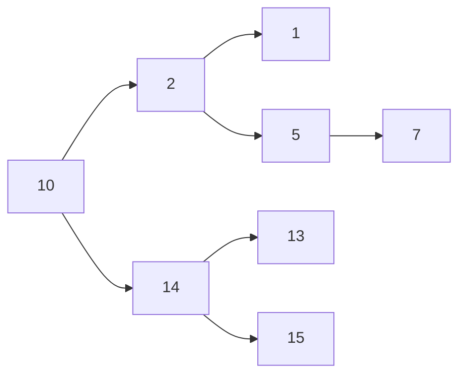
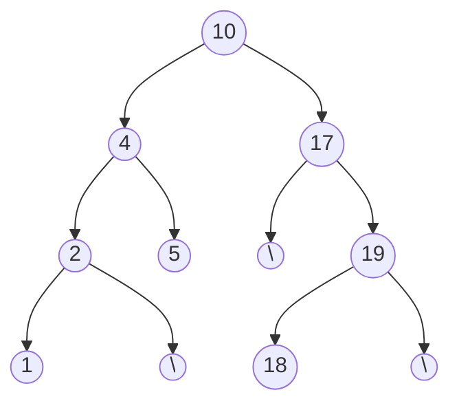
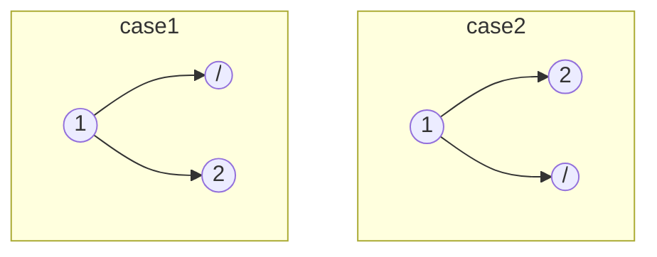

### 1. Two Number Sum:

**Problem**: Given total sum, find a pair of numbers in an array summing to that total sum. </br>
**Example**: For [-4,-1,1,3,5,6,8,11] {10} , ans is [11,-1]. </br>
**Solutions**: </br>

1. Approach 1: Double for loop. T: O(N^2); S O(1).
2. Approach 2: HashSet. T: O(N); S O(N).
3. Approach 3: Sort and Two pointer. T: O(NlogN); S:O(1).
   </br>

---

</br>

### 2. Validate Subsequence:

**Problem**: Check if given subsequence is valid for an array. Subsequence contains array elements in order, but some elements might be skipped.</br>

**Example**: For arr [5,1,22,25,6,-1,8,10] and subseq [1,6,-1,10], ans is true.</br>

**Solutions**:</br>

1. Approach 1: Linear scan of array and check if subseq element is present in order. T: O(N); S:O(1).
   </br>

---

### 3. Sorted Squared Array:

**Problem**: Given sorted a array of int, return its sorted squared int array. Do not modify the input array.</br>
**Example**: For arr [-2,-1,1,2,3,5,6,8,9] ans is [1,1,4,4,9,25,36,64,81]].</br>
**Solutions**:</br>

1. Approach 1: Generate new array with squared values, and then sort that array. T: O(NlogN) ; S: O(N).
2. 2 Pointer, and comparing absolute values. T: O(N) ; S:O(N).
   </br>

---

### 4. Tournament Winner:

**Problem**: Competition and results array given, tell which team is winner. Guaranteed that there is a winner (no tie).</br>
**Example**: For competition Array [[[[ "HTML" ,  "C#"],["C#","python"],["python","HTML"]]]] and results array is [0,0,1]. Answer for winner is "python".</br>
**Solutions**:</br>

1. Approach 1: Hashmap of Team and score. Also keep track of maximum score team on every update of team score. T: O(N) ; S:O(K). (N competitions and K teams).
   </br>

---

### 5. Non-Constructible Change:

**Problem**: Minimum change that cannot be created, considering all the coins available as given in an array. Cannot reuse a coin.</br>
**Example**: For coins array [5,7,1,1,2,3,22], ans is 4.</br>
**Solutions**:</br>

1. Approach 1: Try out in sequence, whether it is possible to construct a sum. Very complicated.
2. Approach 2: Sort the coin array first. If any new coin is greater than C+1 (C is coins cum sum), then we can't create C+1 coin. T: O(NlogN) ; S: O(1).

```java
Arrays.sort(coins);
int currentChangeCreated=0;
for(coin in coins){
	if(coin > currentChangeCreated + 1)
		return currentChangeCreated + 1;
	currentChangeCreater += coin;
}
return currentChangeCreated + 1;
```

</br>

---

### 6. Find Closest Value in BST:

**Problem**: Given a BST, and a target value, find the closest value to target, present in BST. </br>
**Solutions**:</br>

1. Approach 1: Visit all BST nodes and track number with smallest absolute difference. T: O(N) ; S: O(1).
2. Approach 2: If BST node smaller than target, then can eliminate firther search to left of BST node. T: O(N) {for skewed BST, but logN on avg} ; S: (N) {for recursion call stack sweked, but on avg O(logN)}.
3. Approach 3: Iteratively traverse BST. T:O(N); S:O(1).

```java
// Recursive:
private int helper(TreeNode node, int target, int closestNodeVal){
	// Reached end of BST:
	if(node == null) return closestNodeVal;
	// Update the closest value, if current node is appropriate for that.
	if(Math.abs(target - closestNodeVal) > Math.abs(target - node.value)
		closestNodeVal = node.val;
	// if current node too big, then go left:
	if(target < node.value)
		return helper(node.left, target, closestNodeVal);
	// if current node too small, then go right:
	else if(target > node.val)
		return helper(node.right, target, closestNodeVal);
	// current node === target
	else
		return closestNodeVal;
}
// Iterative:
private int helper(TreeNode node, int target){
	closestNodeVal = Integer.MAX_VALUE;
	currentNode = node;
	while(currentNode != null){
		// Update the closest value, if current node is appropriate for that.
		if(Math.abs(target - closestNodeVal) > Math.abs(target - node.value)
			closestNodeVal = currentNode.val;
		// if current node too big, then go left:
		if(target < node.value)
			currentNode = currentNode.left;
		// if current node too small, then go right:
		else if(target > node.val)
			currentNode = currentNode.right;
		// current node === target
		else
			break;
	}
	return closestNodeVal;
}
```

</br>

---

### 7. Branch Sums of Tree:

**Problem**: Given a Tree, return the sum of all branches (from root to leaf) as a list. </br>
**Solutions**: </br>

1. Approach 1: Traverse all nodes of tree in inorder traversal, and keep trac of running sum. On reaching the leaf node, append branch sum to list of branch sums. T: O(N) ; S: O((N + Num\_ of_Leaf nodes) <= 2N => so, N) (skewed tree). </br>
   </br>

---

### 8. Node Depths:

**Problem**: Given a Binary Tree, return the sum of node depths of all nodes of the tree. Here, node depth of tree is the distance between root and node of that tree.</br>
**Solutions**:</br>

1. Approach 1: Recursion. T: O(N) ; S: O(h).
2. Approach 2: Iteration, using a Stack. T:O(N) ; S:O(h).

```java
private int nodeDepth(TreeNode node, int depth=0){
	if(root == null) return 0;
	return depth + nodeDepth(node.left,depth+1) + nodeDepth(node.right,depth+1) ;
}
```

</br>

---

### 9. Depth first search on n-ary Tree:

**Problem**: Given a n-ary Tree, return an array containing DFS traversal. </br>
**Solutions** : </br>

1. Approach 1: Recursion with inorder traversal. T: O(N) ; S: O(h). </br>

```java
private ArrayList<Integer> list = new ArrayList<>();

private void dfs(TreeNode node){
	if(node == null) return;

	list.append(node.val);

	for(TreeNode child : node.children){
		dfs(child);
	}
}
```

</br>

---

### 10. Minimum Waiting Time:

**Problem**: Given an array mentioning time required to execute tasks, output the minimum waiting times to execute all tasks.</br>
**Example**: For jobs with execution times [3,2,1,2,6], the minimum eaiting time is 17. As they can be scheduled as [1,2,2,3,6] giving waiting times as [(0)+(0+1)+(0+1+2)+(0+1+2+2)+(0+1+2+2+3)] = [0+1+3+5+8] = 17.</br>
**Solutions**: </br>

1. Approach 1: Greedy. Sort in Ascending order, and add all execution times till penultimate array element. T: O(NlogN) ; S: O(1).</br>

```java
    private static int minWaitTime(int[] queries){
        Arrays.sort(queries);
        int totalWaitingTime=0;
        for(int i=0 ; i<queries.length-1 ; i++){
            int waitDuration = queries[i];
            int timesRepeated = (queries.length-1 - i);
            totalWaitingTime += waitDuration*timesRepeated;
        }
        return totalWaitingTime;
    }
```

</br>

---

### 11. Class Photos:

**Problem**: Given two arrays of student heights wearing and red and blue shirts. Number of students wearing red and blue shirts are same. They need to be arranged in two rows for a class photo. All red shirts need to be in the same row and all blue shirts need to be in same row. The student standing in front should be shorter than the one standing behind. You can reorder the red and blue shirt students in their rows. Return true if is possible to arrange students for such a class Photo. </br>
**Example**: redShirts=[5,8,1,3,4] ; blueShirts=[9,4,2,4,5]. Answer is True. </br>
**Solutions**: </br>

1. Approach 1: Shirt group with tallest student needs to be in the row behind. Sort red and blue shirt heights. Then keep checking if traversing in descending order in red and blue shirts, the front row guy is always lesser than rear row guys. T: O(NlogN) ; S: O(1).
   </br>

---

### 12. Tandem Bicycle:

**Problem**: Given two arrays of speeds of red shirt and blue shirt riders (of same length). We need to pair them to either get fastest or slowest total speeds. Speed of a pair is the max of the two rider. Find the maximum or minimum total speeds of the tandem bicycle riders.</br>
**Example**: redShirts=[5,5,3,9,2] ; blueShirts=[3,6,7,2,1]. Fastest speed is 32, slowest speed is 25.</br>
**Solutions**:</br>

1. Approach 1: Sort the two arrays. If fastest pairing asked, then group largest of one with the most minimum of other. If slowest is asked, then pair slowest of one with slowest of other. T: O(NlogN) ; S: O(1).
   </br>

---

### 13. Remove Duplicates From Linked List:

**Problem**: Given a sorted Linked Lists, remove the duplicates from the Linked List.</br>
**Example**: LL given = {1->1->3->4->4->4->5->6->6}. Ans is {1->3->4->5->6}.</br>
**Solutions**:</br>

1. Approach 1: Sorted array means that duplicate values will be grouped. T: O(Nl) ; S: O(1).</br>

---

### 14. N-th Fibonacci:

**Problem**: Find the N-th Fibanacci number.</br>
**Solutions**:</br>

1. Approach 1: Recursive, memoised. T: O(N) ; S: O(N).</br>
2. Approach 2: Iterative DP: T: O(N) ; S: O(1).</br>
   </br>

---

### 15. Product Sum:

**Problem**: Array containing numbes and other special arrays. Find Product Sum of the array. For product sum, you sum up the numbers in that array, but if there is a special array inside it then you multiply the depth of that special array in sum of the elements of the special array.</br>
**Example**: For special array [5,2,[7,-1],3,[6,[-13,8],4]], the productSum is 12.</br>
**Solutions**:</br>

1. Approach 1: Recursive.</br>

```java
// O(n) time | O(d) space - where n is total number of elements
// including sub-elements, and d is the greatest depth of "special"
public int productSum(List<Object> array) {
	return productSumHelper(array, 1);
}
private int productSumHelper(List<Object> array, int multiplier){
	int sum = 0;
	for (Object el : array) {
		if (el instanceof ArrayList) {
			@SuppressWarnings("unchecked")
			ArrayList<Object> ls = (ArrayList<Object>) el;
			sum += productSumHelper(ls, multiplier + 1);
		} else {
			sum += (int) el;
		}
	}
	return sum * multiplier;
}
```

</br>

---

### 16. Binary Search:

**Problem**: Binary search for an element in array. </br>
**Solutions**:</br>

1. Approach 1: Recursive.</br>
2. Approach 1: Iterative.</br>
   </br>

---

### 17. Three Largest Numbers:

**Problem**: Given an array, return the sorted array of three largest numbers. </br>
**Solutions**:</br>

1. Approach 1: Sort whole array and return 3 larges.
2. Approach 2: Traverse the whole array and keep track of three largest numbers.
3. Approach 3: Maintain a sorted array (initialized to -Inf values), and shift and update the three largest numbers collected in this array, while linearly traversing the main array.
4. Approach 4: Priority Queue: MinHeap of size 3.
   </br>

---

### 18. Bubble Sort:

**Problem**: Given an array, Bubble sort the array.
**Solutions**:

1. Approach 1: Swap a pair of elements (i,i+1) if elements not sorted in these positions. This is bubbling up. If a swap is performed, then perform above check again. T : O(N^2) ; S : O(1).
   </br>

---

### 19. Insertion Sort:

**Problem**: Given an array, Insertion sort the array.</br>
**Solutions**:

1. Approach 1: At an iteration, array is relatively sorted before the current element and relatively unsorted after the current element position. Just try to place the current element in right place in sorted section, by swapping with consecutively previous element. Perform the rest of the iterations to cover rest of the array. T : O(N^2) ; S : O(1).
   </br>

---

### 20. Selection Sort:

**Problem**: Given an array, Selection sort the array. </br>
**Solutions**:

1. Approach 1: Array gets divided in two parts. Absolutely sorted part and unsorted part. Choose any position, and to get the element which belongs to this position, traverse on unsorted array side and find minimum number to place at the current position. Current position is now also part of the sorted part. Continue for the next element in array. T : O(N^2) ; S : O(1).
   </br>

---

### 21. Palindrome Check:

**Problem**: Check if given string is a palindrome or not.
</br>

---

### 22. Caesar Cipher Encryptor:

**Problem**: Given a string and shiftKey, find the Caesar Ciphered String.</br>
**Example:** string ="xyz", and key=2 ==> encrypted string is "zab".</br>
**Solution:**</br>

```java
public static String caesarCypherEncryptor(String str, int key) {
	char[] newLetters = new char[str.length()];
	int newKey = key % 26;
	for (int i = 0; i < str.length(); i++) {
		newLetters[i] = getNewLetter(str.charAt(i), newKey);
	}
	return new String(newLetters);
}
public static char getNewLetter(char letter, int key) {
	int newLetterCode = letter + key;
	return newLetterCode <= 122 ?
		(char) newLetterCode :
		(char) ( 96 + (newLetterCode) % 122 );
}
```

</br>

---

### 23. Run-Length Encoding:

**Problem**: Compress the string into Run-Length Encoding. Max digits you could encode a repeating char is 9, as if double digit, then can create confusion in encoding (like which part is actually repeated).</br>
**Example:** AAAAAAAAAAAAABBCCCCDD => 9A4A2B4C2D. Not 13A2B4C2D, as not clear whether 13A means 111A or 1AAA. Using delimiter also not allowed, as that might be a part of the string.</br>
**Solution:**</br>

```java
write code
```

</br>

---

### 24. Generate Document:

**Problem**: Given a source String and a destination string, tell if using all the characters of source String, we can make the destination string.</br>
**Solution:** Make FreqMap of source string, and linearly traverse the destination string to reduce the count of characters available from source string. If all the destinatio string characters can be obtained from source string, then OK, but if any character is not available then false.</br>

```java
copy
```

</br>

---

### 25. First Non-Repeating Character:

**Problem**: Given a string, return the first non-repeating character.</br>
**Solution:**

1. Approach 1: Brute force: Double for loop. Starting from the left, for every character, check if that character is present till the end. If present, then this can't be the first non-repeating char. So check the next char. If any such char only appears once, then it is the first non-repeating character. T: O(N^2) ; S: O(1).
2. Approach 2: Char freq map (of only 26 chars possible). Two passes, where first pass is for calculating freq of each char. Second pass is where we check the first character with freq as 1. T: O(N) ; S: O(1).
   </br>

---

### 26. Three Number Sum:

**Problem**: Given an array with non-repeated ints, and a target sum. Find all triplets with the target sum. Do not give duplicate triplets.</br>
**Example:** for arr: [12,3,1,2,-6,5,-8,6] and targetSum =0, we have triplets as [{-8,2,6},{-8,3,5},{-6,1,5}]. </br>
**Solution:**</br>

1. Approach 1: Brute force: 3 for Loops. T: O(N^3) ; S: O(1).
2. Approach 2: Sort the array and use 2 pointers. T: O(N^2) ; S: O(1) {for storing triplets}.
   </br>

---

### 27. Smallest Difference:

**Problem**: Find two closest numbers from two given arrays. So one element comes form one array, and other comes from other elements.</br>
**Example:** for arr1: [-1,5,10,20,28,3] and arr2:[26,134,135,15,17] and the required pair is [28,26].</br>
**Solution:**</br>

1. Approach 1: Brute force: 2 for Loops. 1 on one array and other on other array. T: O(N^2) ; S: O(1).
2. Approach 2: Sort the arrays and use 1 pointer on each array. Keep capturing differences and try to move the smaller element pointer ahead. T: O(NlogN+MlogM) ; S: O(1).
   </br>

---

### 28. Move Element to End:</br>

**Problem**: Given an array and a target number, move all elements equal to target number to the end of the array.</br>
**Example:** for arr: [2,1,2,2,2,3,4,2] and element 2, we have output array as [1,3,4,2,2,2,2,2].</br>
**Solution:**

1. Approach 1: Brute force: Sort the array and start to move the target elemetns to the end. T: O(NlogN) ; S: O(1).
2. Approach 2: 2 Pointers. 1 at beginning and 1 at end. T: O(N) ; S: O(1).
   </br>

```java

// 0(n) time 1 0(1) space - where n is the length of the array
public static List<Integer> moveElementToEnd(List<Integer> array, int toMove) {
	int i = 0;
	int j = array.size() - 1;
	while (i < j) {
		while (i < j && array.get(j) == toMove) // i<j is important here.
			j--;
		if (array.get(i) == toMove)
			swap(i, j, array);
		i++;
	}
	return array;
}

public static void swap(int i, int j, List<Integer> array) {
	int temp = array.get(j);
	array.set(j, array.get(i));
	array.set(i, temp);
}
```

</br>

---

### 29. Monotonic Array:</br>

**Problem**: Given an array tell if it is a monotonic array. Monotonic means either entirely non-decreasing or entirely non-increasing (since duplicate elements possible).</br>
**Solution:**

1. Approach 1: Brute force: Determine the first direction taken by elements, and then ensure that all elements have that. Cumbersome to code.. T: O(N) ; S: O(1).
2. Approach 2: 2 Traversals, once checking if non-increasing and other time checking non-decreasing. If either then true. Can also do within the same loop. T: O(N) ; S: O(1).
   </br>

```java
// 0(n) time 1 0(1) space - where n is the length of the array
public static boolean isMonotonic(int[] array) {
	var isNonDecreasing = true;
	var isNonIncreasing = true;
	for (int i = 1; i < array.length; i++) {
		if (array[i] < array[i - 1]){
			isNonDecreasing = false;
		}
		if (array[i] > array[i - 1]) {
			isNonIncreasing = false;
		}
	}
	return isNonDecreasing || isNonIncreasing;
}

// DIRECTION Approach:
// 0(n) time 1 0(1) space - where n is the length of the array
public boolean isMonotonic(int[] array) {
	if (array.length <= 2)
		return true;
	var direction = array[1] - array[0];
	for (int i = 2; i < array.length; i++) {
		if (direction == 0) {
			direction = array[i] - array[i - 1];
			continue;
		}
		if (breaksDirection(direction, array[i - 1], array[i])) {
			return false;
		}
	}
	return true;
}
public boolean breaksDirection(int direction, int previous, int current){
	var difference = current - previous;
	if (direction > 0) return difference < 0;
	return difference > 0;
}

```

</br>

---

### 30. Spiral Traverse:</br>

**Problem**: Given a rectangular 2d array, return a 1D array which is spiral traversal of the 2d matrix.</br>
**Solution:** </br>

1. Approach 1: T: O(N \* M) ; S: O(1).
2. Approach 2: Recursive Approach, where we deal with every perimeter in one recursion call stack. T: O(N) ; S: O(P), where P is number of perimeters (Min(N,M)).
   </br>

```java
// Iterative:

public static List<Integer> spiralTraverse(int[][] array) {
    if (array.length == 0) return new ArrayList<Integer>();
    var result = new ArrayList<Integer>();
    var startRow = 0;
    var endRow = array.length - 1;
    var startCol = 0;
    var endCol = array[0].length - 1;
    while (startRow <= endRow && startCol <= endCol) {
        for (int col = startCol; col <= endCol; col++) {
            result.add(array[startRow][col]);
        }
        for (int row = startRow + 1; row <= endRow; row++) {
            result.add(array[row][endCol]);
        }
        for (int col = endCol - 1; col >= startCol; col--) {
            if (startRow == endRow) break;
            result.add(array[endRow][col]);
        }
        for (int row = endRow - 1; row > startRow; row--) {
            if (startCol == endCol) break;
            result.add(array[row][startCol]);
        }
        startRow++;
        endRow--;
        startCol++;
        endCol--;
    }
    return result;
}

// Recursive:

public static List<Integer> spiralTraverseRecursive(int[][] array) {
	if (array.length == 0) return new ArrayList<Integer>();
	var result = new ArrayList<Integer>();
	spiralFill(array, 0, array.length - 1, 0, array[0].length - 1, result);
	return result;
}

public static void spiralFill(
	int[][] array, int startRow, int endRow, int startCol, int endCol,ArrayList<Integer> result) {
		if (startRow > endRow || startCol > endCol) {
		return;
	}
	for (int col = startCol; col <= endCol; col++) {
		result.add(array[startRow][col]);
	}
	for (int row = startRow + 1; row <= endRow; row++) {
		result.add(array[row][endCol]);
	}
	for (int col = endCol - 1; col >= startCol; col--) {
		if (startRow == endRow) break;
		result.add(array[endRow][col]);
	}
	for (int row = endRow - 1; row >= startRow + 1; row--) {
		if (startCol == endCol) break;
		result.add(array[row][startCol]);
	}
	spiralFill(array, startRow + 1, endRow - 1, startCol + 1, endCol - 1, result);
}

```

</br>

---

### 31. Length of Longest Peak:</br>

**Problem**: Given an integer array, find the length of longest peak.</br>
**Example**: [1,2,3,3,4,0,10,6,5,-1,-3,2,3] => 6
**Solution:** </br>

1. Approach 1: Find the peaks in the array, and then find the longest run for each peak (on either side of the peak). T: O(N) ; S: O(1).
2. Approach 2: Find the peak and the longest run in the same iteration. T: O(N) ; S: O(1).
   </br>

```java
public static int longestPeak(int[] array) {
	int longestPeakLength = 0;
	int i = 1;
	while (i < array.length - 1) {
		boolean isPeak = array[i - 1] < array[i] && array[i] > array[i + 1];
		if (!isPeak) {
			i += 1;
			continue;
		}
		int leftIdx = i - 2;
		while (leftIdx >= 0 && array[leftIdx] < array[leftIdx + 1]) {
			leftIdx -= 1;
		}
		int rightIdx = i + 2;
		while (rightIdx < array.length && array[rightIdx] < array[rightIdx - 1]) {
			rightIdx += 1;
		}
		int currentPeakLength = rightIdx - leftIdx - 1;
		if (currentPeakLength > longestPeakLength) {
			longestPeakLength = currentPeakLength;
		}
		i = rightIdx;
	}
	return longestPeakLength;
}

```

</br>

---

### 32. Array of Products:</br>

**Problem**: Given an integer array, find the length of longest peak.</br>
**Example**: For [5,1,4,2], the array we have is [8,40,10,20].
**Solution:** </br>

1. Approach 1: Nested 'For' loops at two levels. When i==j, then continue. T: O(N^2) ; S: O(N) (Since need to store products calculate in new array).
2. Approach 2: Prefix and Suffix Product arrays. For each element, multiply prefix and suffix product array values. T: O(N) ; S: O(N).
3. Approach 3: Construct only one amongst the Prefix or Suffix Product arrays. And take a running product element. For each element, running product element with suffix (or prefix product element). T: O(N) ; S: O(N).
   </br>

---

### 33. First Duplicate Value:</br>

**Problem**: Given an integer array, containing numbers from 1 to n with duplicate values. Find the first duplicate value (occuring first as a duplicate in the array, if multiple duplicate values exist). If no duplicate value exists, then return -1. You can mutate the array.</br>
**Example**: For [2,1,5,3,2,3,4] ans is 2 (not 3, since 2 occurs earlier in array).
**Solution:** </br>

1. Approach 1: Nested 'For' loops at two levels. The first duplicate value found is returned. T: O(N^2) ; S: O(1).
2. Approach 2: Use a set, and return the first found duplicate value. T: O(N) ; S: O(N).
3. Approach 3: Make the value and index of (|value|-1) to negative. And every time check if a value is negative. If negative, then this is duplicate value. T: O(N) ; S: O(1).
   </br>

---

### 34. Merge Overlapping Intervals:</br>

**Problem**: Given an array of intervals (with start and end times), return an array of merged intervals. Two intervals are overlapping, if they share any number in their ranges.</br>
**Example**: For [[1,2],[3,5],[4,7],[6,8],[9,20]]] , we get [[1,2],[3,8],[9,10]].
**Solution:** </br>

1. Approach 1:If intervals are sorted in ascending orders of their start times, then two meetings overlap if end0 >= start1 (where 0 and 1 are for two intervals whose start0 <= start1). T: O(NlogN) ; S: O(N) (for the output array of merged intervals).
   </br>

---

### 35. BST Construction:</br>

**Problem**: Insertion, Searching and (importantly) Deletion.</br>
**Solution:** </br>

```java
class Program {

	static class BST {
			public int value;
			public BST left;
			public BST right;
			public BST(int value) {
			this.value = value;
		}

		// Average: O(log(n)) time | O(1) space
		// Worst: O(n) time | O(1) space
		public BST insert(int value) {
			BST currentNode = this;
			while (true) {
				if (value < currentNode.value) {
					if (currentNode.left == null) {
						BST newNode = new BST(value);
						currentNode.left = newNode;
						break;
					} else {
						currentNode = currentNode.left;
					}
				} else {
					if (currentNode.right == null) {
						BST newNode = new BST(value);
						currentNode.right = newNode;
						break;
					} else {
						currentNode = currentNode.right;
					}
				}
			}
			return this;
		}

		// Average: O(log(n)) time | O(1) space
		// Worst: O(n) time | O(1) space
		public boolean contains(int value) {
			BST currentNode = this;
			while (currentNode != null) {
				if (value < currentNode.value) {
					currentNode = currentNode.left;
				} else if (value > currentNode.value) {
					currentNode = currentNode.right;
				} else {
					return true;
				}
			}
			return false;
		}

		// Average: O(log(n)) time | O(1) space
		// Worst: O(n) time | O(1) space
		public BST remove(int value) {
			remove(value, null);
			return this;
		}

		public void remove(int value, BST parentNode) {
			BST currentNode = this;
			while (currentNode != null) {
				if (value < currentNode.value) {
					parentNode = currentNode;
					currentNode = currentNode.left;
				} else if (value > currentNode.value) {
					parentNode = currentNode;
					currentNode = currentNode.right;
				} else {
					if (currentNode.left != null && currentNode.right != null) {
						currentNode.value = currentNode.right.getMinValue();
						currentNode.right.remove(currentNode.value, currentNode);
					} else if (parentNode == null) {
						if (currentNode.left != null) {
							currentNode.value = currentNode.left.value;
							currentNode.right = currentNode.left.right;
							currentNode.left = currentNode.left.left;
						} else if (currentNode.right != null) {
							currentNode.value = currentNode.right.value;
							currentNode.left = currentNode.right.left;
							currentNode.right = currentNode.right.right;
						} else {
							// This is a single-node tree; do nothing.
						}
					} else if (parentNode.left == currentNode) {
						parentNode.left = currentNode.left != null ? currentNode.left : currentNode.right;
					} else if (parentNode.right == currentNode) {
						parentNode.right = currentNode.left != null ? currentNode.left : currentNode.right;
					}
					break;
				}
			}
		}

		public int getMinValue() {
			if (left == null) {
				return value;
			}
			return left.getMinValue();
		}
	}
}
```

---

### 36. Validate BST:</br>

**Problem**: Validate a BST.</br>
**Solution:** </br>

```java
class Program {
	// O(n) time | O(d) space
	public static boolean validateBst(BST tree) {
		return validateBst(tree, Integer.MIN_VALUE, Integer.MAX_VALUE);
	}

	public static boolean validateBst(BST tree, int minValue, int maxValue) {
		if (tree.value < minValue || tree.value >= maxValue) {
			return false;
		}
		if (tree.left != null && !validateBst(tree.left, minValue, tree.value)) {
			return false;
		}
		if (tree.right != null && !validateBst(tree.right, tree.value, maxValue)) {
			return false;
		}
		return true;
	}

	static class BST {
		public int value;
		public BST left;
		public BST right;
		public BST(int value) {
			this.value = value;
		}
	}
}
```

---

### 37. BST Tree Traversals:</br>

**Problem**: Inorder, Pre-Order, Post-Order.</br>
**Solution:** </br>

---

### 38. Min Height BST:</br>

**Problem**: Given a _sorted_ array of _distinct_ integers, return a BST with minimum height. Insert method given to you.</br>
**Example:** for [1,2,5,7,10,13,14,15,22] we have following as a min Height BST.</br>



**Solution:** </br>

- Approach 1: We want BST to be as balanced in left and right subtrees. So root node will be the middle element of the sorted input array. Recursively repeat the process.

```java
// O(n) time | O(n) space - where n is the length of the array
public static BST minHeightBst(List<Integer> array) {
	return constructMinHeightBst(array, 0, array.size() - 1);
}
public static BST constructMinHeightBst(List<Integer> array, int startIdx, int endIdx) {
	if (endIdx < startIdx) return null;
	int midIdx = (startIdx + endIdx) / 2;
	BST bst = new BST(array.get(midIdx));
	bst.left = constructMinHeightBst(array, startIdx, midIdx - 1);
	bst.right = constructMinHeightBst(array, midIdx + 1, endIdx);
	return bst;
}
```

</br>

---

### 39. Find Kth Largest Value in BST:</br>

**Problem**: Find K-th largest value in BST. </br>
**Solution:** </br>

- Approach 1: In order traversal with a counter in BST. Also track the value of kth node. T:O(N) ; S:O(N).
- Approach 2: Reverse In order traversal with a counter in BST. Also track the kth node value. T:O(N) ; S:O(N).

</br>

---

### 40. Reconstruct BST:</br>

**Problem**: Given pre-order traversal of a BST consisting of unique values, construct a BST with the same pre-order traversal. </br>
**Example**: For pre-order traversal array : [10,4,2,1,5,17,19,18], the BST is:



**Insight:** For a given preorder traversaal, there are many Binary trees possible, but only 1 BST possible. For [1,2] as pre-order traversal, have following possible BTs. </br>



**Solution:**

- Approach 0: Unique Binary tree can be constructed using an inorder and preOrder traversal. BST's inorder traversal is a sorted array. So sort the preOrder array to get inOrder array, and construct the unique Binary tree for that. T: O(NlogN), S: O(N).
- Approach 1: First node is root. Then onwards all the smaller elements constitute left subtree. And all the greater elements form right subtree. Do a postorder traversal where curent node's left and right subtrees are created first, and then linked to current node. T:O(N^2) ; S:O(N).
- Approach 2: Tracking 3 things, and creating a node if node value ()is in range. T:O(N) ; S:O(N) :
  - rootIndex: the index of the node in preorder traversal we are trying to create.
  - lower bound value for node's value. Start with -Inf.
  - upper bound value for node's value. Start with +Inf.

```java

// Approach 1:
class Solution{
	public void solve(int[] preOrder)){
		if(preOrder.length == 0) return null;
		return helper(preOrder, 0, preOrder.length);
	}

	private TreeNode helper(int[] preOrder, int lowIdx, int highIdx){
		if(highIdx<lowIdx) return null;

		int currNodeValue = new TreeNode(preOrder[lowIdx]);
		int leftSubtreeRightBound = preOrder.length;
		for(int i=lowIdx ; i<highIdx ; i++){
			if(currNodeValue < preOrder[i] ){
				leftSubtreeRightBound = i;
				break;
			}
		}

		TreeNode node = new TreeNode(currNodeValue);
		node.left = helper(preOrder, lowIdx+1, leftSubTreeRightBound);
		node.right = helper(preOrder, leftSubTreeRightBound , highIdx);

		return node;
	}
}

// Approach 2:
class Solution {
    int idx=0;
    public TreeNode bstFromPreorder(int[] preorder) {
        return helper(Integer.MIN_VALUE,Integer.MAX_VALUE,preorder);
    }

    private TreeNode helper(int lo, int hi, int[] preorder){
        if(idx==preorder.length) return null;

        int value = preorder[idx];
        if(value<lo || value>hi) return null;

        idx++;
        TreeNode root = new TreeNode(value);
        root.left  = helper(lo,value,preorder);
        root.right = helper(value,hi,preorder);

        return root;
    }
}
```

</br>

---

### 41. Invert Binary Tree:</br>

**Problem**: Invert a given Binary tree.</br>
**Solution:**

- Approach 1: Iterative-BFS: level by level, and swap every node's child nodes. Then move to the next level. T: O(N), S:O(N)
- Approach 2: Recursively-DFS: Just invert the right and left child of each node. T:O(N) ; S:O(N).

</br>

---
